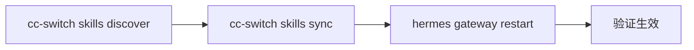

# 更新技能源 — 从仓库拉取到 Gateway 生效

## 流程



## 步骤

1. **发现最新 skill** — 从启用的远程仓库（如 cursor-config）拉取最新列表
   ```bash
   cc-switch skills discover -a hermes
   ```

2. **同步到 Hermes** — 将发现的新/更新 skill 同步到 Hermes 技能目录
   ```bash
   cc-switch skills sync -a hermes
   ```

3. **重启 Gateway** — 让新 skill 在当前会话中生效
   ```bash
   hermes gateway restart
   ```

4. **验证** — 确认 Gateway 已重启并加载了新 skill
   ```bash
   hermes gateway status
   # 应显示 "running"
   ```

## RED：没有本 skill 时 agent 的失败模式

| 场景 | agent 会怎么做 | 问题 |
|------|---------------|------|
| 用户说「更新skill」 | 可能只 `skill_view` 重新加载，不改底层文件 | 远程仓库的新 skill 没拉下来 |
| 用户说「把新技能生效」 | 可能只重启 Gateway，没先 sync | 旧 skill 重启了但新 skill 没进来 |
| 用户说「同步 cursor-config」 | 可能只 `git pull` 不跑 cc-switch | cc-switch 的 SSOT 和文件系统不同步 |

## 🚫 不要做的事

| 反模式 | 为什么 | 正确做法 |
|--------|--------|----------|
| 跳过 discover 只跑 sync | sync 只处理已注册的技能，新技能不会被发现 | 先 discover，再 sync |
| 跳过 sync 直接 restart | Gateway 重启后 skill 目录没变 | 三步必须全做 |
| 用 `git pull` 代替 cc-switch | git pull 只更新本地仓库，不更新 Hermes 的 skill 目录 | 用 `cc-switch skills discover` |

## 完整示例

完整操作过程见 [[assets/few-shot-example/]]。

## 关联 skill

- `preview-tunnel` — 打开/关闭 Cloudflare Tunnel 预览
- `hermes-file-conventions` — 文件路径规范
