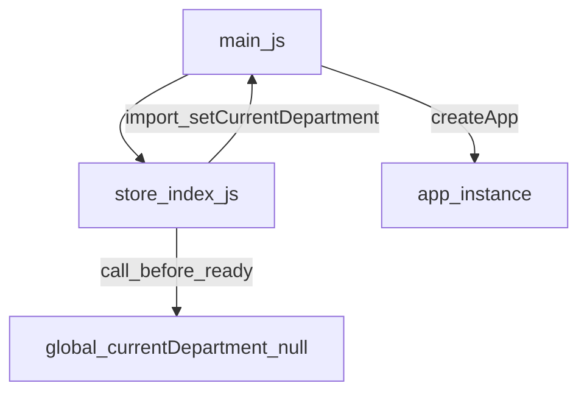

## 高风险问题：`currentDepartment` 循环依赖导致生产环境权限失效

### 1. 现象（Symptoms）

- 生产环境登录后，依赖 `$currentDepartment` 的功能入口缺失或不稳定，例如：
  - “工具箱 / 工具仓”不显示（`$currentDepartment.ops.has('toolBox')` 为 `false`）
  - “回写”等按钮不显示（`$currentDepartment.ops.has('needIP')` 为 `false`）
- 开发环境表现正常，生产环境出现**功能缺失 / 权限误判**的不一致问题。

### 2. 影响面（Impact）

- **权限判断全部偏弱化**：大量 `v-if="$currentDepartment && $currentDepartment.ops.has('xxx')"` 被短路为 `false`。
- **业务可用性下降**：用户误以为自己没有权限或功能没上线，实际是初始化链路异常。
- **问题定位困难**：生产构建经过压缩 / 分包后，循环依赖导致的初始化顺序问题难以直观看出。

### 3. 触发条件（Trigger）

- 生产构建（`vue-cli-service build`）后，打包优化带来的**模块初始化顺序差异**：
  - chunk 拆分 / tree-shaking / 压缩重排。
- 登录或页面刷新时，`store` 的 mutation 先执行到 `setCurrentDepartment(...)`，
  而此时 `main` 中的 `app` 尚未完成创建 / 注入全局属性。

### 4. 根因分析（Root Cause）

**核心问题：存在高风险循环依赖**

- `src/main.js`：
  - `import store from './store'`（应用创建时引入 store）
- `src/store/index.js`：
  - `import { setCurrentDepartment } from '@/main'`（store 反向依赖 main 的方法）

形成依赖闭环：

在这种闭环下：

- 某些构建产物中，`store` 可能在 `app` 创建前就执行了 `setCurrentDepartment`。
- 导致：
  - `app.config.globalProperties.$currentDepartment` 未正确写入或仍为 `null`。
  - `sessionStorage` 中的 `currentDepartment` 也可能未按预期持久化 / 恢复。
  - 所有依赖 `$currentDepartment.ops.has(...)` 的逻辑被动“降级”为无权限。

### 5. 排查清单（Checklist）

- 登录后确认：
  - `store.mutations.setData` 是否被调用？
  - `value.user` 是否存在？`value.user.department` 是否正确？
  - `commonParam.departmentMap` 是否命中该部门？
- 在浏览器控制台检查：
  - `sessionStorage.getItem('currentDepartment')` 是否存在？
  - 解析后的对象中是否包含 `ops` 字段？是否为数组或 Set？
  - `window.__VUE_DEVTOOLS_GLOBAL_HOOK__` 或 devtools 中 `$currentDepartment` 的实际值。
- 若生产环境看不到日志：
  - 检查 `vue.config.js` 是否配置了 `drop_console` / `pure_funcs` 抹掉了关键日志。

### 6. 修复策略（Fix Strategy）

**核心思路：抽离 `currentDepartment` 的存取 / 持久化逻辑为独立 service，打断循环依赖。**

1. **新增纯模块（无反向依赖）**
   - 新增：`src/utils/currentDepartmentService.js`
   - 职责：
     - 保存 `app` 引用。
     - 提供 `initCurrentDepartment(app)`：初始化 `$currentDepartment` 并从 `sessionStorage` 恢复。
     - 提供 `setCurrentDepartment(department)`：写入全局属性并持久化（处理 `ops: Set` 的序列化 / 反序列化）。
     - （可选）提供 `getCurrentDepartment()`：用于调试 / 校验。
   - 约束：**禁止**在该模块中 `import` `main`、`store`、`router`，避免新的循环依赖。

2. **main 只负责 app 创建与注入**
   - 修改 `src/main.js`：
     - 删除原有的 `setCurrentDepartment` / `restoreCurrentDepartment` 实现。
     - 在 `const app = createApp(App)` 后调用 `initCurrentDepartment(app)`。
     - 其他 `app.use(...).mount(...)` 保持不变。

3. **store 只依赖 service，不再依赖 main**
   - 修改 `src/store/index.js`：
     - 将 `import { setCurrentDepartment } from '@/main'`
       改为 `import { setCurrentDepartment } from '@/utils/currentDepartmentService'`。
     - 保持 `mutations.setData` / `removeData` 的业务逻辑不变。

> 这样可以保证：`src/main.js` 只负责应用启动与注入，`src/store/index.js` 只依赖一个“工具模块”，
> 两者不再形成直接环路，生产 / 开发环境的初始化顺序差异对 `$currentDepartment` 的影响被消除。

### 7. 预防措施（Prevention）

- **编码规范层面**
  - 约束：`store` 层禁止直接依赖 `main`，如需全局能力统一通过 util/service 注入。
  - 在 code review 中专门关注：是否有 `@/main` 这类反向依赖。

- **工程化层面**
  - 在 CI 中接入循环依赖检测（如 madge 等工具），将循环依赖视为构建失败级别问题。
  - 在关键全局属性（如 `$currentDepartment`）的初始化逻辑中，加入对“未 init 直接 set”的防护提示。

- **运维 / 排查层面**
  - 保留一条简单可搜索的日志前缀（例如 `[currentDepartment]`），方便在生产日志中快速定位整条链路。
  - 在故障复盘文档中引用本文件，作为“全局属性 + 循环依赖”类问题的典型案例。

