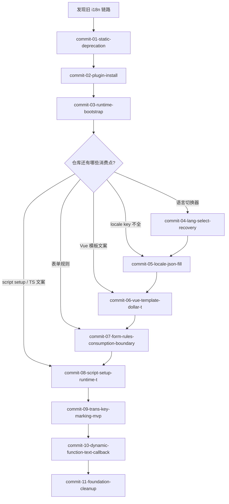

# Orchestration Flow

```mermaid
flowchart TD
    A[发现旧 i18n 链路] --> B[commit-01-static-deprecation]
    B --> C[commit-02-plugin-install]
    C --> D[commit-03-runtime-bootstrap]
    D --> E{仓库还有哪些消费点?}
    E -->|语言切换器| F[commit-04-lang-select-recovery]
    E -->|locale key 不全| G[commit-05-locale-json-fill]
    E -->|Vue 模板文案| H[commit-06-vue-template-dollar-t]
    E -->|表单规则| I[commit-07-form-rules-consumption-boundary]
    E -->|script setup / TS 文案| J[commit-08-script-setup-runtime-t]
    J --> K[commit-09-trans-key-marking-mvp]
    K --> L[commit-10-dynamic-function-text-callback]
    L --> M[commit-11-foundation-cleanup]

    F --> G
    G --> H
    H --> I
    I --> J
```

## 使用说明

- `commit-01` 到 `commit-03` 是主干，默认都要完成。
- `commit-04` 到 `commit-08` 按仓库剩余消费点选择，但推荐从浅层到深层推进。
- `commit-09` 到 `commit-11` 处理提取器和动态文本边界，是新方案稳定落地的收尾段。
