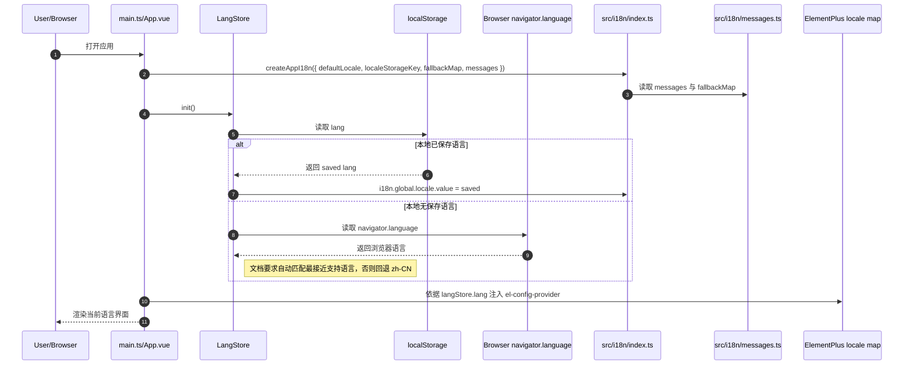
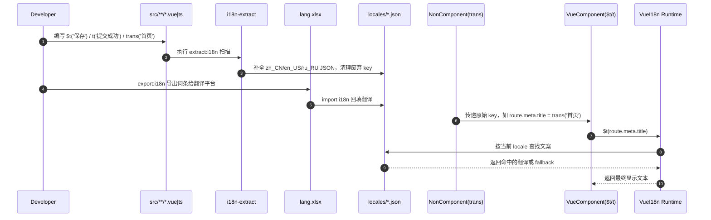

# i18n-server docs 新链路分析

## 范围

本文分析 `F:\Documents\Repertory\Sieyuan\nebula\.cursor\nebula-skills\i18n-server\docs` 下除后端说明外的目标 i18n 设计文档，目的是重建“新 i18n 链路”本身，而不是分析现有代码实现。

本次纳入的文档：

- `国际化方案.md`
- `前端国际化方案说明.md`
- `国际化场景分析.md`
- `国际化方案（参考）.md`

不纳入：

- `后端国际化方案说明.md`

## 入口清单

| 入口类型 | 文档定位 | 关键符号 | 作用 |
| --- | --- | --- | --- |
| i18n runtime 创建入口 | `前端国际化方案说明.md:101-119` | `createAppI18n()` | 定义新的前端 i18n 运行时单例 |
| 语言包聚合入口 | `前端国际化方案说明.md:122-142` | `messages` `fallbackMap` `LANG_STORAGE_KEY` | 管理 runtime locale 与文件名映射 |
| 词条抽取配置入口 | `前端国际化方案说明.md:145-160` | `defineI18nExtractConfig()` | 定义扫描目录、语言列表、自动排序与清理规则 |
| 语言状态入口 | `前端国际化方案说明.md:163-191` | `useLangStore` `setLang()` `init()` | 持久化语言值并驱动运行时切换 |
| 应用注册入口 | `前端国际化方案说明.md:194-213` | `app.use(i18n)` `el-config-provider` | 在应用挂载时注册 runtime，并桥接 Element Plus |
| 组件取词入口 | `前端国际化方案说明.md:204-208,237-261` | `$t` `useI18n().t` | 页面模板和脚本内直接翻译 |
| 非组件标记入口 | `前端国际化方案说明.md:263-279,657-674` | `trans()` | 在路由、常量、枚举里只标记 key，不直接翻译 |
| 词条维护入口 | `前端国际化方案说明.md:393-423,542-639` | `extract:i18n` `export:i18n` `import:i18n` `lang.xlsx` | 扫描、导出、翻译回填、清理无用词条 |
| 语言来源入口 | `国际化方案.md:77-88,303-303,541-543` | `Accept-Language` `localStorage` `navigator.language` | 定义首次进入、持久化恢复和默认兜底规则 |
| 数据类国际化入口 | `国际化方案.md:171-217` `国际化场景分析.md:42-66,374-380` | `JSON字段扩展法` `code + locale + value` | 区分词条型文本、枚举/模板型文本和用户输入内容 |
| 时间/格式化入口 | `国际化方案.md:268-383` `国际化方案（参考）.md:254-258` | `UTC` `timezoneContext` `Intl API` | 定义时间、数字、货币等本地化展示策略 |
| 组态工具入口 | `国际化方案.md:438-455` `国际化场景分析.md:297-313` | 画面 JSON 多语言字段 / 抽取脚本 | 定义组态画面中文本的抽取与渲染方式 |

## 核心场景划分

### 场景 1：应用初始化

- 应用启动时通过 `createAppI18n()` 创建单例，并指定：
- `defaultLocale = 'zh-CN'`
- `localeStorageKey = 'lang'`
- `messages`
- `fallbackMap`
- `globalInjection = true`
- 应用挂载时执行 `app.use(i18n)`。
- `useLangStore.init()` 在启动阶段读取本地 `lang`，恢复上次语言。
- `App.vue` 通过 `el-config-provider` 依赖当前 `langStore.lang`，同步切换 Element Plus locale。

### 场景 2：语言选择与持久化

- 文档定义了用户级语言优先于租户语言的前端显示策略。
- 首次进入时优先读取本地存储；若不存在，则根据 `navigator.language` 自动匹配；再不匹配则 fallback 到 `zh-CN`。
- 用户切换语言后执行 `setLang(lang)`：
- 写 `i18n.global.locale.value`
- 写 `langStore.lang`
- 写 `localStorage`
- 页面刷新后通过 `init()` 恢复。

### 场景 3：组件渲染取词

- Vue 模板直接用 `$t('保存')`。
- `script setup` 或 TS 脚本里通过 `useI18n().t()` 取词。
- 文案 key 直接使用中文原文，不再先定义英文式语义 key。
- 运行时支持变量插值、复数、语境区分。

### 场景 4：非组件文件取词

- 路由、常量、枚举映射等非组件文件不直接翻译，而是先调用 `trans('首页')`。
- `trans()` 在运行时只返回原字符串，用于抽取脚本识别词条。
- 真正展示时，在组件层再执行 `$t(route.meta.title)` 或 `$t(STATUS_MAP['1'])`。

### 场景 5：词条扫描、导出、回填

- `extract:i18n` 扫描 `src/**/*.js|ts|vue`。
- 抽取模式包括：
- `t('...')`
- `$t('...')`
- `this.$t('...')`
- `i18n.global.t('...')`
- `trans('...')`
- 抽取后自动：
- 补全 `src/i18n/locales/*.json`
- 保留已有翻译
- 清理无引用旧 key
- 排序写回
- `export:i18n` 导出 `lang.xlsx` 给平台翻译。
- `import:i18n` 再把翻译后的结果写回对应语言 JSON。

### 场景 6：业务数据国际化

- 文档将需要展示给用户的内容分成多类：
- 代码/配置里的固定文案：走词条抽取链路
- 枚举/字典/模板类文本：走 `code + locale + value` 或 `message_key + params`
- 用户输入类文本：走 `JSON字段扩展法`
- 新链路因此不是“只有一条前端词条链路”，而是“UI 词条链路 + 数据型文本策略链路”并存。

### 场景 7：时间、数字、货币、本地化格式

- 时间统一存 UTC，展示跟随租户时区。
- 前端负责把租户时区时间转换为 UTC 发给后端，再把返回的 UTC 还原展示。
- 数字、货币、日期格式由前端基于 locale 统一格式化，文档推荐使用 `Intl API` 或 `vue-i18n` 的 `numberFormats / datetimeFormats`。

### 场景 8：组态工具与画面 JSON

- 编辑态和浏览态都纳入国际化。
- 画面 JSON 中的文本节点可以：
- 内嵌多语言字段
- 或由脚本抽取到语言包
- 渲染时按当前语言动态替换文本节点，不修改原始画面文件。

## 时序图

### 场景 A：前端初始化与语言恢复

### 场景 B：词条标记、抽取与运行时显示

## 参与者定义表

| 图中变量 | 运行时中是什么 | 文档定位 | 关键变量/函数 | 说明 |
| --- | --- | --- | --- | --- |
| `APP` | 应用启动与 UI 桥接层 | `前端国际化方案说明.md:194-213` | `createApp(App).use(i18n)` `el-config-provider` | 注册 i18n 插件并桥接 Element Plus |
| `IR` | 新前端 i18n runtime | `前端国际化方案说明.md:101-119` | `createAppI18n()` | 目标运行时单例 |
| `MSG` | 语言包聚合与 fallback 配置 | `前端国际化方案说明.md:122-142` | `messages` `fallbackMap` `LANG_STORAGE_KEY` | 连接 locale 编码、语言包文件与降级规则 |
| `LS` | 语言状态 store | `前端国际化方案说明.md:163-191,217-232` | `useLangStore` `setLang()` `init()` | 负责语言切换和本地恢复 |
| `ST` | 浏览器持久化存储 | `前端国际化方案说明.md:178-187` `国际化方案.md:303,541-543` | `localStorage['lang']` | 保存用户语言偏好 |
| `BI` | 浏览器语言来源 | `国际化方案.md:77,303,543` | `Accept-Language` `navigator.language` | 提供首次匹配的语言信号 |
| `VC` | 组件渲染层 | `前端国际化方案说明.md:204-208,237-261` | `$t()` `useI18n().t()` | 真正触发翻译渲染 |
| `NC` | 非组件标记层 | `前端国际化方案说明.md:263-279,657-674` | `trans()` | 标记 key，运行时不直接翻译 |
| `EXT` | 抽取与同步工具链 | `前端国际化方案说明.md:145-160,393-423` | `defineI18nExtractConfig()` `extract:i18n` | 扫描代码、维护语言包 |
| `LOC` | 本地语言包资产 | `前端国际化方案说明.md:347-390` | `zh_CN.json` `en_US.json` `ru_RU.json` | 词条最终来源 |
| `XLS` | 翻译中间产物 | `前端国际化方案说明.md:542-639` | `lang.xlsx` | 项目与平台翻译工具的交换文件 |
| `EL` | Element Plus locale 桥接层 | `前端国际化方案说明.md:211-232,750-754` | `src/i18n/element.ts` | 使组件库内置文案跟随业务语言 |

## 变量 / 函数 / 文件落点表

| 字段/符号 | 运行时含义 | 文档定位 | 关键变量/函数 |
| --- | --- | --- | --- |
| `defaultLocale` | 默认界面语言 | `前端国际化方案说明.md:111-118` | `'zh-CN'` |
| `LANG_STORAGE_KEY` | 本地语言存储键 | `前端国际化方案说明.md:131-132` | `'lang'` |
| `messages` | locale 到语言包的映射表 | `前端国际化方案说明.md:134-137` | `'zh-CN': zhCN`, `'en-US': enUS` |
| `fallbackMap` | 缺失词条回退关系 | `前端国际化方案说明.md:139-142,375-390` | `en-US -> zh-CN`, `ru-RU -> en-US` |
| `setLang(lang)` | 语言切换动作 | `前端国际化方案说明.md:177-182,217-221` | `i18n.global.locale.value = lang` |
| `init()` | 启动恢复动作 | `前端国际化方案说明.md:183-188,223-225` | 从 `localStorage` 恢复 |
| `$t()` / `t()` | 组件内翻译入口 | `前端国际化方案说明.md:204-208,237-261` | `$t('保存')` |
| `trans()` | 非组件词条标记入口 | `前端国际化方案说明.md:265-279,657-674` | `trans('首页')` |
| `i18n-extract.config.ts` | 抽取规则配置文件 | `前端国际化方案说明.md:145-160` | `srcDir` `localeDir` `languages` |
| `extract:i18n` | 扫描并回写语言包 | `前端国际化方案说明.md:397-423,637-639` | `pnpm exec i18n-extract ...` |
| `lang.xlsx` | 翻译中间交换文件 | `前端国际化方案说明.md:542-639,769` | `excel:export` / `excel:import` |
| `Accept-Language` | 请求级语言上下文 | `国际化方案.md:77,134,199` `国际化方案（参考）.md:113` | 后端查询和消息渲染的 locale 输入 |
| `navigator.language` | 浏览器默认语言来源 | `国际化方案.md:303,543` | 首次访问自动匹配 |
| `JSON字段扩展法` | 用户输入类文本的多语言存储策略 | `国际化方案.md:171-217` `国际化场景分析.md:42-66,378-380` | `{ "deviceName": { "zh-CN": "...", "en-US": "..." } }` |
| `message_key + params` | 系统消息、模板、错误信息的结构化策略 | `国际化方案（参考）.md:128-141,172-192,280` | `message_key` `params` |
| `UTC + timezoneContext` | 时间交互规范 | `国际化方案.md:346-383` `国际化场景分析.md:200-204,271-279` | 前端负责时区转换 |

## 关键结论

### 1. 当前语言值从哪里来

新链路把语言值来源定义成一个显式优先链：

1. 本地持久化 `localStorage['lang']`
2. 浏览器 `navigator.language` 或请求头 `Accept-Language`
3. 默认 `zh-CN`

这里“租户默认语言”不用于前端界面语言，只用于后端处理告警、审计等入库文本。

### 2. 当前翻译运行时如何被消费

新链路把消费面拆成两类：

- 组件内：直接 `$t()` / `t()`
- 非组件：先 `trans()` 标记，再到组件层 `$t()` 真正翻译

这意味着目标方案明确不鼓励在非组件文件里直接做运行时翻译。

### 3. 哪些变量、函数、文件承担关键角色

关键角色不是单一 runtime，而是一个完整闭环：

- `src/i18n/index.ts` 负责运行时
- `src/i18n/messages.ts` 负责语言包和回退
- `src/stores/lang.ts` 负责语言状态与持久化
- `src/i18n/locales/*.json` 负责词条资产
- `i18n-extract.config.ts` + CLI 负责词条治理
- `lang.xlsx` 负责对接平台翻译

### 4. 新链路本质上是“双轨制”

新方案不是所有文本都进入同一词条体系，而是至少分成两条轨：

- UI 固定文案：中文 key + 本地语言包 + 抽取脚本
- 数据型文本：`JSON字段扩展法` 或 `code + locale + value` / `message_key + params`

这点决定了后续迁移不能只盯着 `vue-i18n` 文件夹。

## 风险与前置约束

### 风险 1：语言码规范仍有双轨

- 前端新链路要求运行时 locale 使用 `zh-CN / en-US / ru-RU`。
- 语言包文件名却使用 `zh_CN / en_US / ru_RU`。
- 数据型文本示例里又出现了 `zh-CN`、`zh_CN` 两种写法。

结论：需要在“运行时 locale”“文件名”“数据库 JSON 字段”之间明确唯一映射规范，否则会重复出现旧链路那种口径错位问题。

### 风险 2：前端 UI 国际化和数据国际化不是同一问题

- 文档把 UI 文案、用户输入、枚举字典、审计告警、导入导出、组态 JSON 放到了不同策略里。
- 如果实施时只完成 `$t()` 和语言包抽取，业务上仍然会有大量“已国际化但数据没国际化”的假完成状态。

### 风险 3：`trans()` 只是标记，不是翻译

- 新链路明确要求非组件文件只调用 `trans()`。
- 如果有人把 `trans()` 当成最终翻译函数使用，界面会直接显示原始 key。

### 风险 4：中文即 key 的维护成本高

- 方案明确用中文原文做 key。
- 文案微调会导致外语翻译失效，抽取脚本会把旧 key 清理、新 key 重新加入。
- 这要求文案变更和翻译流程必须强绑定。

### 风险 5：时间和语言需要持续解耦

- 文档多次强调语言不推导时区，时间全部按 UTC 传输、前端负责转换。
- 如果后续实现把 locale 和 timezone 混用，会直接破坏统计查询和展示一致性。

### 风险 6：组态工具是单独的大坑

- 组态工具既有编辑态又有浏览态，还包含用户输入文本和画面 JSON。
- 这部分即使复用同一套语言包，也不能简单等同于普通 Vue 页面。

## 可作为后续落地切入口的部位

- 第一切入口：先建立前端基础链路
  `src/i18n/index.ts`、`messages.ts`、`stores/lang.ts`、`App.vue`
- 第二切入口：再建立词条治理链路
  `i18n-extract.config.ts`、`extract/export/import`、`lang.xlsx`
- 第三切入口：最后处理业务数据链路
  用户输入 JSON、枚举 code、模板化消息、导入导出、组态 JSON

## 迁移时必须保持不变的行为

- 语言切换后，Vue i18n 文案和 Element Plus 内置文案必须同步切换。
- 页面刷新后要恢复用户上次选择的语言。
- 非组件词条在展示时必须仍能被组件层翻译。
- 时间字段必须继续以 UTC 交互、按租户时区展示。
- 用户输入类文本不能被误当成静态 UI 词条处理。
