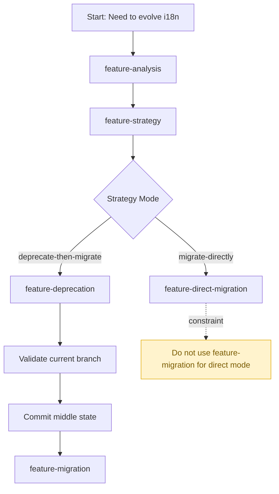

# Feature Orchestrator

用于编排 `i18n-server` 下的多个子 skill，告诉用户和 agent 应该按什么顺序消费这些 skill。

它不直接负责实现旧链路分析、退化或迁移，而是负责：

- 判断当前应该进入哪个子 skill
- 说明每个子 skill 的输入输出关系
- 输出推荐执行顺序
- 提供可渲染的 Mermaid 图，帮助人类快速理解流程

## 适用场景

- 用户面对 `i18n-server` 下多个 skill，不确定先用哪个。
- 需要把“分析、策略、退化、迁移、一步到位”串成统一操作手册。
- 需要给团队提供一个统一入口，而不是让每个人自己猜流程。

## 输入

- 用户当前目标：分析、退化、两步迁移、一步到位迁移、只想判断策略。
- 当前仓库状态：是否已有旧链路、是否已做分析、是否已进入中间态。

## 输出

- 推荐 skill 路由。
- 推荐执行顺序。
- 当前阶段不该使用的 skill。
- 一张可渲染的 Mermaid 编排图。

## 子 skill 编排关系

1. `feature-analysis`
   - 先讲清旧链路。

2. `feature-strategy`
   - 再判断该两步走还是一步到位。

3. `feature-deprecation`
   - 退化旧链路：只在策略结论为“两步走”时使用。

4. `feature-migration`
   - 迁移新链路：只在“两步走”且已经完成退化后使用。

5. `feature-direct-migration`
   - 迁移新链路：只在策略结论为“一步到位”时使用。

## 流程图

阅读说明：

- `feature-analysis` 永远是起点。
- `feature-strategy` 决定进入“两步走”还是“一步到位”。
- `feature-migration` 只属于“两步走”分支。
- `feature-direct-migration` 只属于“一步到位”分支。

## 模板说明

`template` 下提供：

- 编排决策模板
- Mermaid 渲染图模板
- `microfb` 的示例编排说明
