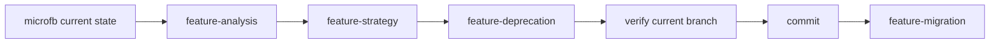

# microfb Orchestration

## Current Recommendation

对于 `microfb`，当前推荐编排顺序是：

1. `feature-analysis`
2. `feature-strategy`
3. `feature-deprecation`
4. 验证当前开发环境正常
5. 提交中间态代码
6. `feature-migration`

## Why

- `microfb` 当前旧链路里有 runtime/store 双写
- 非组件层直接依赖 `i18n.global.t`
- 旧语言包结构和新方案差异不小
- 先退化能把风险切成两段，更适合分批提交

## Do Not Use

- 不建议直接跳到 `feature-migration`
- 不建议对 `microfb` 使用 `feature-direct-migration`

## Mermaid

