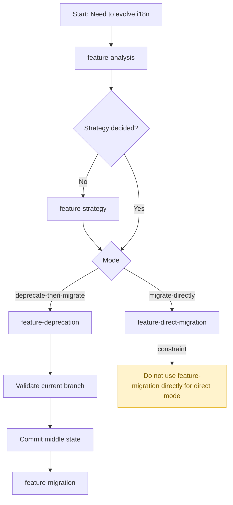

# Render Diagram

```mermaid
flowchart TD
    A[Start: Need to evolve i18n] --> B[feature-analysis]
    B --> C{Strategy decided?}
    C -- No --> D[feature-strategy]
    D --> E{Mode}
    C -- Yes --> E
    E -- deprecate-then-migrate --> F[feature-deprecation]
    F --> G[Validate current branch]
    G --> H[Commit middle state]
    H --> I[feature-migration]
    E -- migrate-directly --> J[feature-direct-migration]

    K[Do not use feature-migration directly for direct mode]:::warn
    J -. constraint .-> K

    classDef warn fill:#fff3cd,stroke:#e0a800,color:#7a5b00;
```

## Reading Guide

- `feature-analysis` 永远是起点。
- `feature-strategy` 决定后续进入哪条分支。
- `feature-migration` 只属于“两步走”分支。
- `feature-direct-migration` 只属于“一步到位”分支。
