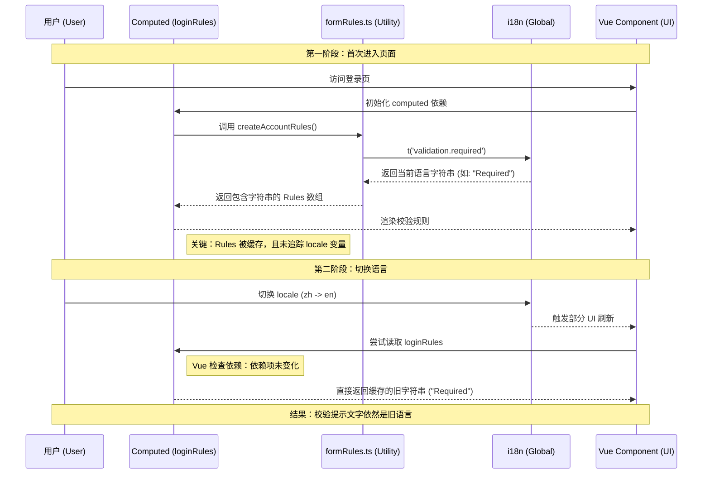
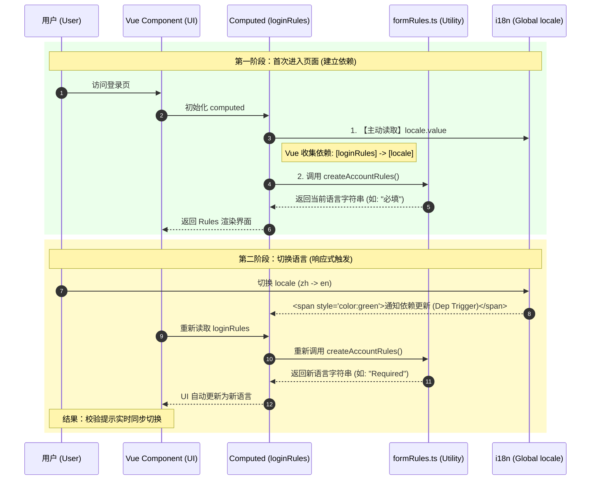

# computed懒计算中添加国际化声明以实现语言同步

把它当成一句更白的话：

`void i18n.global.locale.value;` 的意思是：

“我不用这个值做计算，但我要让 Vue 知道：这个 `computed` 跟当前语言有关。”

它写在这里：

[Login.vue](</F:/Documents/Repertory/Sieyuan/nebula/microfb/src/views/login/components/Login.vue:217>)
[LoginForgotPassword.vue](</F:/Documents/Repertory/Sieyuan/nebula/microfb/src/views/login/components/LoginForgotPassword.vue:143>)
[LoginForgotPassword.vue](</F:/Documents/Repertory/Sieyuan/nebula/microfb/src/views/login/components/LoginForgotPassword.vue:156>)
[LoginActivate.vue](</F:/Documents/Repertory/Sieyuan/nebula/microfb/src/views/login/components/LoginActivate.vue:82>)

而根因在这里：

[formRules.ts](</F:/Documents/Repertory/Sieyuan/nebula/microfb/src/utils/formRules.ts:14>)

## 先用费曼式解释

把 `computed` 想成一个“懒计算盒子”。

Vue 会问这个盒子：

“你依赖谁？以后谁变了，我就让你重新算。”

Vue只能靠“你在计算时读过谁”来判断依赖。

现在看这段：

```ts
const loginRules = computed(() => {
  void i18n.global.locale.value;
  return {
    account: createAccountRules(),
    password: createPasswordRules(),
  };
});
```

这里它读了 `locale.value`，所以 Vue 记住：

“这个 rules 盒子依赖当前语言。”

以后语言从 `zh_CN` 变成 `en_US`，Vue 就会重新执行这个 `computed`。

## 为什么偏偏这里要读 `locale`

因为翻译不是在模板里发生的，也不是在这个 `computed` 里直接写的 `t(...)`。

而是在纯 TS 工厂里，提前发生了：

[formRules.ts](</F:/Documents/Repertory/Sieyuan/nebula/microfb/src/utils/formRules.ts:26>)
[formRules.ts](</F:/Documents/Repertory/Sieyuan/nebula/microfb/src/utils/formRules.ts:49>)

例如：

```ts
const t = (key: string) => i18n.global.t(key);

function requiredRule(message) {
  return {
    required: true,
    message: t(message),
  };
}
```

注意这里的 `message: t(message)`。

这一步一执行，拿到的已经不是“会自动变的翻译函数”，而是“当下语言下的普通字符串”。

比如当前语言是中文时：

```ts
message: "请输入验证码"
```

它不会自己长成英文。

## 整个链路的伪代码

### 1. 语言状态

```ts
i18n.global.locale.value = "zh_CN"
```

### 2. 页面生成 rules

```ts
const rules = computed(() => {
  void i18n.global.locale.value
  return createRules()
})
```

### 3. `createRules()` 里面调用纯 TS 规则工厂

```ts
function createRules() {
  return {
    code: [requiredRule("验证码必填")]
  }
}
```

### 4. `requiredRule()` 立刻翻译

```ts
function requiredRule(key) {
  return {
    required: true,
    message: i18n.global.t(key)
  }
}
```

如果当前语言是中文，结果就变成：

```ts
{
  required: true,
  message: "请输入验证码"
}
```

这时 `message` 已经是普通字符串了。

## 为什么 `void` 很关键

`void` 不是关键，关键是“读了一次 `locale.value`”。

这两种都能建立依赖：

```ts
i18n.global.locale.value;
const _ = i18n.global.locale.value;
void i18n.global.locale.value;
```

之所以用 `void`，是因为它最明确地表达：

- 我要读取它
- 但我故意不用这个值
- 我只是为了依赖追踪

也就是：

“不是业务逻辑，只是告诉 Vue 这里跟语言有关。”

## 如果不加，会怎样

假设代码变成这样：

```ts
const rules = computed(() => {
  return {
    code: [requiredRule("验证码必填")]
  }
})
```

第一次算的时候，当前语言是中文：

```ts
rules = {
  code: [{ message: "请输入验证码" }]
}
```

然后用户切语言到英文：

```ts
i18n.global.locale.value = "en_US"
```

问题来了：

- `computed` 里没有读 `locale.value`
- Vue 不知道这个 `rules` 跟语言有关
- 所以它不会重新执行这个 `computed`
- 原来的 rules 对象继续复用
- 校验提示还是旧中文

于是你会看到一种很典型的现象：

- 页面上别的地方，直接 `$t(...)` 的文字变英文了
- 但表单校验错误提示还停在中文

因为两者翻译时机不一样。

## 对比一下两种情况

### 情况 A：模板里直接翻译

```vue
<div>{{ $t("登录") }}</div>
```

这里语言一变，模板会重新渲染，文案自然更新。

### 情况 B：规则工厂里提前翻译

```ts
const rules = computed(() => ({
  code: [{ message: i18n.global.t("请输入验证码") }]
}))
```

这里如果 `computed` 不依赖 `locale`，那么语言变了，`computed` 不重跑，字符串就不更新。

所以才要补这一句：

```ts
void i18n.global.locale.value;
```

## 再用一个更生活化的比喻

把 `formRules.ts` 想成打印机。

`i18n.global.t(...)` 是“按当前语言打印一张纸”。

打印完就是纸了，不是电子屏，不会自己跟着语言切换。

那怎么办？

你只能在语言切换后“重新打印一张”。

而 `void i18n.global.locale.value;` 的作用，就是让 Vue 知道：

“语言一变，这里要重新打印 rules。”

## 用最短的话总结

`void i18n.global.locale.value;` 的作用是：

- 不是取值
- 不是业务判断
- 是给 `computed` 人工补一个“语言依赖”

因为：

- `formRules.ts` 里 `i18n.global.t(...)` 会把文案提前算成普通字符串
- 普通字符串不会自动跟着语言变
- 所以语言切换时必须让 `computed rules` 重新执行
- 不加这句，就可能出现“页面变英文了，但校验提示还是中文”

## “加了 / 不加”两条链路

如果你愿意，我下一条可以直接画一张“加了 / 不加”两条链路的时序图，几行就能彻底看懂。

先看“加了”和“不加”两条链路。

### **不加 `void i18n.global.locale.value`**



伪代码就是：

```ts
const loginRules = computed(() => {
  return {
    account: createAccountRules(), // 里面已经提前翻译成字符串了
    password: createPasswordRules(),
  };
});
```

问题点在这句：

```ts
createAccountRules()
```

它返回的不是“会自动变的翻译”，而是：

```ts
[
  { message: "请输入手机号/邮箱地址" }
]
```

如果后面切到英文，这个字符串不会自己变成：

```ts
[
  { message: "Please enter phone number/email" }
]
```

因为它已经是算完的结果了。

---

### **加了 `void i18n.global.locale.value`**



伪代码：

```ts
const loginRules = computed(() => {
  void i18n.global.locale.value; // 先登记：我依赖语言
  return {
    account: createAccountRules(),
    password: createPasswordRules(),
  };
});
```

---

### **把整条链路连起来看**

```ts
// 1. 当前语言
i18n.global.locale.value = "zh_CN";

// 2. 组件里生成 rules
const loginRules = computed(() => {
  void i18n.global.locale.value;
  return {
    account: createAccountRules(),
  };
});

// 3. 纯 TS 工厂里提前翻译
function createAccountRules() {
  return [
    requiredRule(MSG.accountRequired)
  ];
}

function requiredRule(messageKey) {
  return {
    required: true,
    message: i18n.global.t(messageKey), // 这里立刻变成普通字符串
  };
}
```

第一次执行后，实际结果更像这样：

```ts
loginRules.value = {
  account: [
    {
      required: true,
      message: "请输入手机号/邮箱地址"
    }
  ]
}
```

这已经是最终字符串了。

切语言后，唯一让它更新的方法就是：

```ts
重新执行 computed
-> 重新调用 createAccountRules()
-> 重新调用 i18n.global.t(...)
-> 重新生成 message
```

而让 `computed` 愿意重跑的触发器，就是：

```ts
void i18n.global.locale.value;
```

---

### **一句话版时序图**

```text
不加:
locale 变化 -> computed 无感知 -> rules 不重建 -> 校验文案不变

加了:
locale 变化 -> computed 感知到 -> rules 重建 -> 校验文案更新
```

---

### **为什么别的地方不用这么写**

因为像模板里的：

```vue
{{ $t("登录") }}
```

或者组件里直接：

```ts
const title = computed(() => t("登录"))
```

翻译动作本身就发生在响应式上下文里，语言变了，它更容易自然重算。

但这里不是。这里是：

- 组件 `computed` 调纯 TS 工厂
- 工厂里提前 `i18n.global.t(...)`
- 得到普通字符串
- 所以组件必须手动把 `locale` 登记成依赖

---

### **最费曼的一句话**

`void i18n.global.locale.value` 就像是在对 Vue 说：

“虽然我下面没直接写 `t()`，但你记住，我产出的这份 rules 其实和当前语言有关。语言一变，请你让我重新算一遍。”

如果你愿意，我可以再进一步把这个例子改写成“完全不用 `void` 的另一种写法”，顺便比较哪种更清晰。