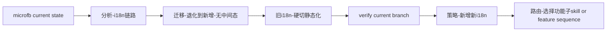

# microfb Orchestration

## Current Recommendation

对于 `microfb`，当前推荐编排顺序是：

1. `分析-i18n链路`
2. `迁移-退化->新增(无中间态)`
3. `旧i18n-硬切静态化`
4. 验证当前开发环境正常
5. `策略-新增新i18n`
6. `路由-选择功能子skill` 或直接进入新增阶段的功能序列

## Why

- `microfb` 当前旧链路里有 runtime/store 双写
- 非组件层直接依赖 `i18n.global.t`
- 旧语言包结构和新方案差异不小
- 先退化，再独立规划新增新 i18n，最容易分阶段验证

## Do Not Use

- 不建议在链路不明确时跳过 `分析-i18n链路`
- 不建议对 `microfb` 直接使用 `迁移-收敛旧到新(有中间态)`

## Mermaid

