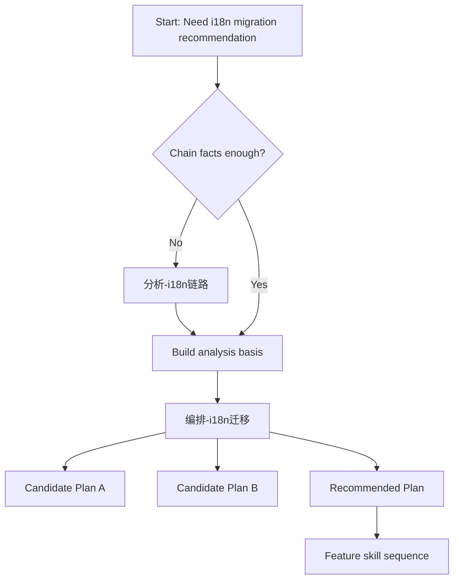

# Render Diagram

```mermaid
flowchart TD
    A[Start: Need i18n migration recommendation] --> B{Chain facts enough?}
    B -- No --> C[分析-i18n链路]
    C --> D[Build analysis basis]
    B -- Yes --> D
    D --> E[编排-i18n迁移]
    E --> F[Candidate Plan A]
    E --> G[Candidate Plan B]
    E --> H[Recommended Plan]
    H --> I[Feature skill sequence]
```

## Reading Guide

- `分析-i18n链路` 是总编排可复用的前置能力，不是强制每次都单独暴露给用户。
- `编排-i18n迁移` 负责比较方案，不负责代替单次功能路由。
- 方案推荐必须建立在 `analysisBasis` 之上。
