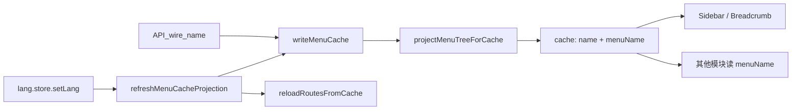

# 缓存双字段投影架构

适用于导航菜单树等写入 localStorage / 全局缓存、多模块共享读展示字段的场景。表单 wire 契约见 `I18nInput-wire字段契约.md`。

## 数据流

## 核心规则

1. **写入口投影**：只在 `writeMenuCache`（或同类唯一写入口）内调用 `projectMenuTreeForCache`；`name` 保留 wire，`menuName` 为当前 locale 文案。
2. **语言切换**：`lang.store.setLang` 末尾 `void refreshMenuCacheProjection()`；**不要**放在 `i18n.ts`，避免与 menu-repo 循环依赖。
3. **路由 meta**：`refreshMenuCacheProjection` 内动态 import permission store，若 `routesLoaded` 则 `reloadRoutesFromCache()`。
4. **读侧收口**：壳层直接 `{{ menuName }}` / `{{ meta.title }}`，删除 `resolveI18nText` wrapper。
5. **管理页分流**（不走导航缓存时）：
   - `menuPageSource`：wire 真相源（编辑/提交）
   - `displayMenuPageSource = computed(() => projectMenuTreeForCache(menuPageSource, locale))`
   - 表格/Tab 读 `menuName`；表单校验仍读 wire `name`

## 不宜做的事

- 不新建 `menu-display.map.ts` / `menu-locale-sync.ts`（投影内聚 domain repo，如 `menu-repo.ts`）
- 不在本阶段改 FormDialog I18nInput 接线
- 不在每个业务模块重复 `void locale.value` + resolve

## 基座 microfb

- `StableMenuNode` 增加 `name?`（wire）
- `mapWire2StableMenuNode`：`name` 与 `menuName` 双字段映射
- 与 apex 相同：`refreshMenuCacheProjection` + `reloadRoutesFromCache`

## 验证

- 单测：wire `name` 保留、`menuName` 按 locale 投影
- 手动：切换中/英文 → 侧栏、面包屑、菜单管理 Tab/表格同步；编辑表单 wire 回填正确
