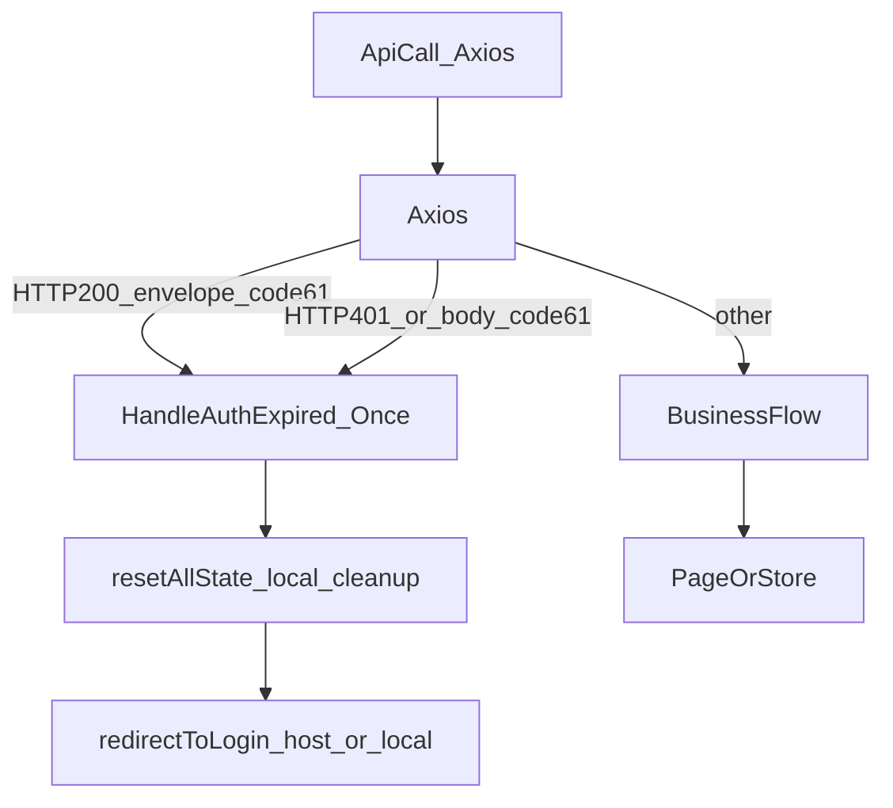

# 设计：code=61 认证失败“原地解散”中间件

## 背景与目标

- **现状**
  - 路由侧 `microfb/src/plugins/permission.ts` 仍保留会话校验缓存失效逻辑：`invalidateSessionVerifyState()`，并在异常兜底里调用 `useUserStore().resetAllState()` + 跳登录。
  - 请求侧 `microfb/src/utils/request.ts` 已有 axios 全局拦截：
    - request：v2 使用 Cookie-Session (`withCredentials=true`)；v1 使用 Bearer token。
    - response：HTTP 401 会 `resetAllState()` 并跳登录（含基座桥接）。
    - 业务错误（HTTP 200 且 `data.code != 0`）统一 `Promise.reject({type:'business',...})`。
  - 用户登出流程 `microfb/src/store/modules/user/user.store.ts` 目前仍会优先调用 `AuthGateway.logout()` 再做本地清理。
- **目标（你提出的新规则）**
  - 后端静默校验，前端不再主动做“会话 verify”。
  - 只要任何接口返回 `**code:61`**（无论是 HTTP 200 的业务包装，还是 401/403 响应体），前端在**全局拦截器**里接住并执行一次性“原地解散”：
    - 清理本地缓存/状态（token、userInfo、menu cache、定时器等）
    - 直接跳登录（优先基座登录桥接，否则本地 `/login?redirect=`）
    - **不再调用 logout 接口**（避免额外请求、避免后端依赖）

## 关键约束与边界（明确化）

- **覆盖范围**：你选择“all-api”，即 v1 + v2 全覆盖。
- **响应形态**：你确认 `code=61` **两种都可能**：
  - HTTP 200 + JSON envelope：`{ code: 61, message: '会话已过期', data: null }`
  - HTTP 401/403 + body 里也可能有 `{code:61,...}`
- **避免循环**：在 `/login` 与 `/login/verify` 页面上，拦截器触发时应**只做本地清理，不再重复 push/redirect**（当前 `request.ts` 已有类似保护）。
- **并发风暴**：多请求同时返回 61 时，只允许执行一次“原地解散”（需要全局幂等锁）。

## 方案对比（2-3 种）

### 方案A（推荐）：axios 全局响应拦截器内置 `code61` 处理 + 统一的 `handleAuthExpired()` 幂等函数

- **做法**
  - 在 `microfb/src/utils/request.ts` 的 response success 分支（HTTP 200、非 blob、且 envelope）里，增加 `code === 61` 的特殊分支：直接调用 `handleAuthExpired(message)`，并短路 reject（或返回一个特殊标记，但推荐 reject 让调用方中断）。
  - 在 response error 分支（HTTP 401/403/500 等）里，除了 status===401 的现有逻辑，再额外检查 `response.data?.code === 61`，同样触发 `handleAuthExpired()`。
  - 抽一个本模块私有的幂等函数（或单独文件）：
    - `let authExpiredHandling = false;`
    - 若已处理过则直接返回；否则设置为 true 并执行：`useUserStoreHook().resetAllState()` + 跳登录（优先 `buildHostLoginUrl`）。
- **优点**
  - 改动面最小，符合“所有 API 一处收口”。
  - 与现有 `redirectToLogin()`/桥接逻辑高度复用（`request.ts` 已具备）。
  - 对调用方侵入最少：不需要每个 API 手动判断 code。
- **缺点/注意**
  - 需要明确“触发后对业务层 Promise 的表现”：通常应 reject，避免页面继续使用过期数据。

### 方案B：引入统一 `ApiError` 类型 + 在拦截器把 `code=61` 转成 `AuthExpiredError`，由上层（路由守卫/全局 error handler）消费

- **做法**
  - 拦截器仅“抛出结构化错误”，不做跳转；由全局 error handler（例如 app-level plugin）统一跳登录。
- **优点**
  - 责任更清晰：网络层只做解析，导航层只做跳转。
- **缺点**
  - 你们当前已经在 `request.ts` 内部做跳转，改成分层会牵涉更多文件与调用链；不满足“先快收敛”的目标。

### 方案C：仍保留路由守卫兜底为主（permission.ts），拦截器只负责置一个“已过期标记”

- **不推荐原因**
  - 过期信号来自接口响应，放到路由守卫会导致“停留当前页但接口都失败”的体验更差，也更难及时阻断业务操作。

**推荐结论**：选 **方案A**。

## 设计细节（推荐方案A）

### 1) “原地解散”中间件的触发条件

在 `microfb/src/utils/request.ts` 统一判定：

- **success 分支**：`isApiResponseEnvelope(data) && Number(data.code) === 61`
- **error 分支**：
  - `status === 401`（现有逻辑继续保留）
  - 或 `isApiResponseEnvelope(response.data) && Number(response.data.code) === 61`

> 这样能覆盖你确认的“两种都可能”。

### 2) 幂等与防风暴

- 设计一个模块级别锁：`let isAuthExpiredHandling = false`。
- 触发时：
  - 若已在处理：直接返回（或返回一个被拒绝的 Promise，避免业务继续）。
  - 否则：设置锁 → 清理本地状态 → 跳登录 → 保持锁为 true（直到刷新页面）。

### 3) 清理范围（MVP）

复用既有 `useUserStoreHook().resetAllState()`，因为它已经覆盖：

- token 清理：`Auth.clearAuth()`
- userInfo/menu cache 清理：`Storage.remove/sessionRemove` + `clearMenuCache()`
- 定时器停止：`stopAutoRefresh()`

后续移除 session verify 后，`resetAllState()` 内也应同步去掉 `invalidateSessionVerifyState()`。

### 4) 跳转策略（与现状一致）

复用 `request.ts` 内 `redirectToLogin()`：

- 在 `/login` 与 `/login/verify`：不重复跳
- 否则：
  - 有 `buildHostLoginUrl(fullPath)` → `window.location.href`
  - 无 → `router.push(/login?redirect=...)`

### 5) 移除旧逻辑（仅设计，供后续实现）

- **删除会话校验缓存模块**：`microfb/src/plugins/session-verify-state.ts` 及其测试 `microfb/src/api/gateway/__tests__/session-verify-state.test.ts`
- **路由守卫移除调用点**：`microfb/src/plugins/permission.ts` 里 `invalidateSessionVerifyState()` 与 `clearVerifySessionCache()`（若仅用于 verify）
- **用户 store 移除 logout API 依赖**：
  - `microfb/src/store/modules/user/user.store.ts`：
    - 设计成“登出按钮”也只走本地清理 + 跳登录（不再 `AuthGateway.logout()`）
    - 跳转策略与拦截器一致（优先基座登录，无则本地）

## 数据流示意（mermaid）

## 验收标准（后续实现时的验证点）

- 任意接口返回 `{code:61,...}`：
  - 只触发一次本地清理与跳转（并发不重复）
  - 不会再调用 logout API
  - 登录页/verify 页不会被重复 push 造成抖动
- HTTP 401（无 code）仍按现有逻辑跳转登录
- v2 Cookie-Session 与 v1 Bearer token 都能命中该规则

## 涉及文件（定位清单）

- `microfb/src/utils/request.ts`（axios 全局拦截器，新增 code=61 分支与幂等处理）
- `microfb/src/plugins/permission.ts`（移除 session verify 失效相关逻辑）
- `microfb/src/plugins/session-verify-state.ts`（计划删除）
- `microfb/src/api/gateway/__tests__/session-verify-state.test.ts`（计划删除）
- `microfb/src/store/modules/user/user.store.ts`（登出流程改成本地清理 + 跳登录，移除 logout API）

