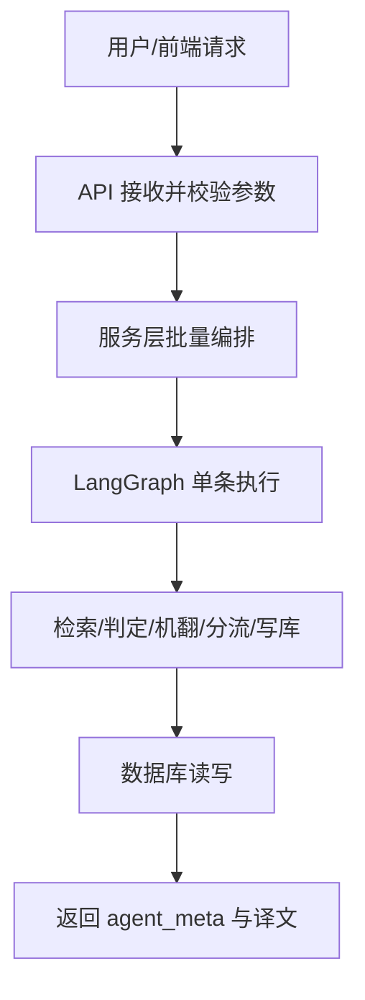

# 全项目分层与边界

## 标准目录树

```
terminology-agent/app/
├── api/                    # HTTP 薄壳 → 只调 services
│   ├── router.py
│   └── tests/
├── services/               # 业务域编排（Application 层）
│   └── <domain>/
│       ├── service.py      # 编排入口
│       ├── single.py       # 单条用例（可选）
│       ├── mappers.py      # 纯函数（可选）
│       └── tests/
├── graph/                  # LangGraph 工作流引擎
│   ├── README.md           # 跨图索引
│   ├── shared/             # 跨图 devtools
│   └── <workflow>/
│       ├── README.md       # 域级 SSOT（双轨 Mermaid 必写）
│       ├── state.py
│       ├── builder.py
│       ├── runner.py
│       ├── domain/
│       ├── edges/
│       ├── nodes/
│       ├── utils/
│       ├── prompts/
│       └── tests/
├── repository/             # 唯一 DB 访问
├── schemas/                # Pydantic 请求/响应
├── models/                 # ORM
├── core/                   # 异常、响应包装
├── conftest.py
├── testing/fixtures/
├── tests/                  # 全局级（settings 等）
└── main.py
```

## 调用链（业务可读）



## 各层职责

| 层 | 职责 | 禁止 |
|----|------|------|
| api | HTTP 解析、委托、响应包装 | 业务逻辑、DB、LangGraph |
| services | 批量编排、领域用例 | LangGraph 节点实现 |
| graph | 单条工作流 State/Nodes/Edges | HTTP、批量循环 |
| repository | CRUD | 业务规则 |

## 与前端类比

| 前端 | 后端 |
|------|------|
| `views/<domain>/index.vue` | `services/<domain>/service.py` |
| `composables/utils` | `mappers.py` / `utils/` |
| 组件 | `graph/nodes/` |
