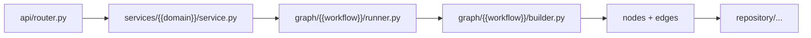
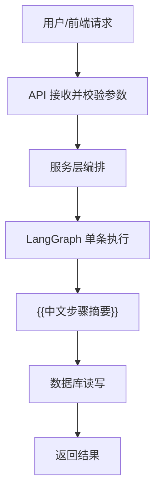
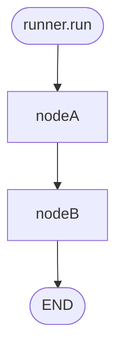
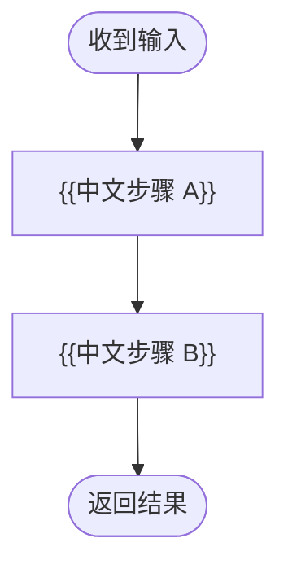
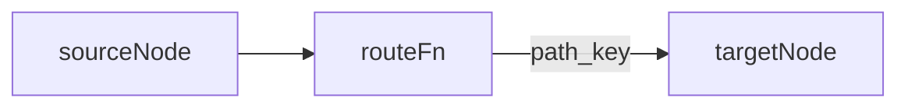
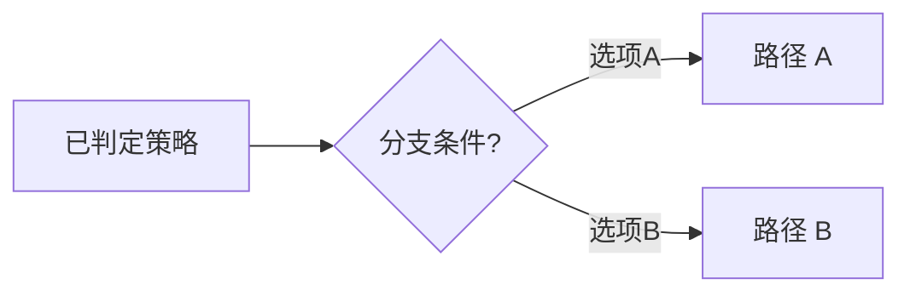

# {{WorkflowName}} — {{中文工作域名}} LangGraph 工作域

← 图级索引：[`../README.md`](../README.md) · 节点规范：[`nodes/README.md`](nodes/README.md)

## 1. 这个 Agent 做什么

{{一段话：本工作域解决什么业务问题；批量/HTTP 是否在 services 层}}

---

## 2. 在全项目中的位置

### 源码对照（调用链）



### 业务说明（人类阅读）



---

## 3. 本包目录树

```
{{workflow}}/
├── README.md
├── state.py
├── builder.py
├── runner.py
├── domain/
├── edges/
├── nodes/
├── utils/
├── prompts/
└── tests/
```

---

## 4. 主流程

### 源码对照（与 builder 一致）



### 业务说明（人类阅读）



---

## 5. 条件边（若有）

### 源码对照



### 业务说明（人类阅读）



---

## 6. State 字段

| 分组 | 字段 | 说明 |
|------|------|------|

---

## 7. 节点一览

| 节点名 | 中文职责 | 文件 |
|--------|----------|------|

---

## 8. 维护 Checklist

- [ ] 改 builder 后同步双轨 Mermaid
- [ ] 补 tests/
- [ ] 更新 graph/README.md 域索引
