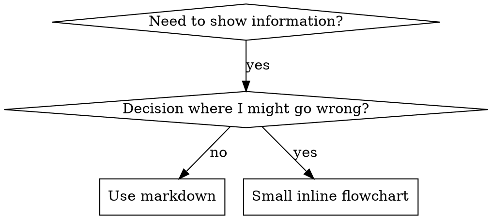

# 编写技能

## 概述

**编写技能就是将测试驱动开发应用于流程文档。**

**个人技能位于代理特定目录中（Claude Code 为 `~/.claude/skills`，Codex 为 `~/.codex/skills`）**

你编写测试用例（带子代理的压力场景），看它们失败（基线行为），编写技能（文档），看测试通过（代理遵守），然后重构（关闭漏洞）。

**核心原则：** 如果你没有看到代理在没有技能的情况下失败，你不知道技能是否教授了正确的内容。

**必需背景：** 在使用此技能之前，你必须理解 superpowers:test-driven-development。该技能定义了基本的 RED-GREEN-REFACTOR 循环。此技能将 TDD 适应到文档。

**官方指南：** 有关 Anthropic 的官方技能编写最佳实践，请参阅 anthropic-best-practices.md。本文档提供了补充此技能中 TDD 重点方法的其他模式和指南。

## 什么是技能？

**技能** 是经过验证的技术、模式或工具的参考指南。技能帮助未来的 Claude 实例找到并应用有效的方法。

**技能是：** 可重用技术、模式、工具、参考指南

**技能不是：** 关于你如何解决一次问题的叙述

## 技能的 TDD 映射

| TDD 概念 | 技能创建 |
|-------------|----------------|
| **测试用例** | 带子代理的压力场景 |
| **生产代码** | 技能文档（SKILL.md） |
| **测试失败（RED）** | 代理在没有技能的情况下违反规则（基线） |
| **测试通过（GREEN）** | 代理在有技能时遵守 |
| **重构** | 在保持遵守的同时关闭漏洞 |
| **先写测试** | 在编写技能之前运行基线场景 |
| **看它失败** | 记录代理使用的确切合理化 |
| **最少代码** | 编写解决这些特定违规的技能 |
| **看它通过** | 验证代理现在遵守 |
| **重构循环** | 找到新的合理化 → 堵塞 → 重新验证 |

整个技能创建过程遵循 RED-GREEN-REFACTOR。

## 何时创建技能

**创建时机：**
- 技术对你来说不是直观明显的
- 你会在项目中再次引用这个
- 模式广泛适用（不是项目特定的）
- 其他人会受益

**不要为以下情况创建：**
- 一次性解决方案
- 在其他地方有良好文档的标准实践
- 项目特定约定（放在 CLAUDE.md 中）
- 机械约束（如果可以用正则表达式/验证强制执行，自动化它——为判断调用保存文档）

## 技能类型

### 技术
具有要遵循步骤的具体方法（condition-based-waiting、root-cause-tracing）

### 模式
思考问题的方式（flatten-with-flags、test-invariants）

### 参考
API 文档、语法指南、工具文档（office docs）

## 目录结构

```
skills/
  skill-name/
    SKILL.md              # 主要参考（必需）
    supporting-file.*     # 仅在需要时
```

**扁平命名空间** - 所有技能在一个可搜索的命名空间中

**单独文件用于：**
1. **重型参考**（100+ 行）- API 文档、综合语法
2. **可重用工具** - 脚本、实用程序、模板

**保持内联：**
- 原则和概念
- 代码模式（< 50 行）
- 其他一切

## SKILL.md 结构

**前置元数据（YAML）：**
- 仅支持两个字段：`name` 和 `description`
- 总共最多 1024 个字符
- `name`：仅使用字母、数字和连字符（无括号、特殊字符）
- `description`：第三人称，仅描述何时使用（不描述它做什么）
  - 以"Use when..."开头以专注于触发条件
  - 包括特定症状、情况和上下文
  - **绝不总结技能的过程或工作流**（见 CSO 部分了解原因）
  - 如果可能，保持在 500 个字符以下

```markdown
---
name: Skill-Name-With-Hyphens
description: Use when [specific triggering conditions and symptoms]
---

# Skill Name

## Overview
这是什么？1-2 句话的核心原则。

## When to Use
[如果决策不明显，小的内联流程图]

带症状和使用案例的要点列表
何时不使用

## Core Pattern (for techniques/patterns)
前后代码比较

## Quick Reference
用于扫描常见操作的表格或要点

## Implementation
简单模式的内联代码
重型参考或可重用工具的文件链接

## Common Mistakes
出错的地方 + 修复

## Real-World Impact (optional)
具体结果
```

## Claude 搜索优化（CSO）

**对发现至关重要：** 未来的 Claude 需要找到你的技能

### 1. 丰富的描述字段

**目的：** Claude 读取描述以决定为给定任务加载哪些技能。让它回答："我现在应该阅读这个技能吗？"

**格式：** 以"Use when..."开头以专注于触发条件

**关键：描述 = 何时使用，不是技能做什么**

描述应该只描述触发条件。不要在描述中总结技能的过程或工作流。

**为什么这很重要：** 测试显示，当描述总结技能的工作流时，Claude 可能会遵循描述而不是阅读完整的技能内容。说"任务之间的代码审查"的描述导致 Claude 进行一次审查，即使技能的流程图清楚地显示了两次审查（规范合规性然后代码质量）。

当描述改为仅"Use when executing implementation plans with independent tasks"（无工作流摘要）时，Claude 正确读取了流程图并遵循了两阶段审查过程。

**陷阱：** 总结工作流的描述创建了 Claude 会采用的捷径。技能主体变成了 Claude 跳过的文档。

```yaml
# ❌ 错误：总结工作流 - Claude 可能遵循这个而不是阅读技能
description: Use when executing plans - dispatches subagent per task with code review between tasks

# ❌ 错误：太多过程细节
description: Use for TDD - write test first, watch it fail, write minimal code, refactor

# ✅ 好：只是触发条件，无工作流摘要
description: Use when executing implementation plans with independent tasks in the current session

# ✅ 好：仅触发条件
description: Use when implementing any feature or bugfix, before writing implementation code
```

**内容：**
- 使用表示此技能适用的具体触发器、症状和情况
- 描述*问题*（竞态条件、不一致行为）而不是*语言特定症状*（setTimeout、sleep）
- 保持触发器与技术无关，除非技能本身是技术特定的
- 如果技能是技术特定的，在触发器中明确说明
- 用第三人称编写（注入到系统提示中）
- **绝不总结技能的过程或工作流**

```yaml
# ❌ 错误：太抽象、模糊、不包括何时使用
description: For async testing

# ❌ 错误：第一人称
description: I can help you with async tests when they're flaky

# ❌ 错误：提到技术但技能不是特定于它的
description: Use when tests use setTimeout/sleep and are flaky

# ✅ 好：以"Use when"开头，描述问题，无工作流
description: Use when tests have race conditions, timing dependencies, or pass/fail inconsistently

# ✅ 好：技术特定技能，带明确触发器
description: Use when using React Router and handling authentication redirects
```

### 2. 关键词覆盖

使用 Claude 会搜索的词：
- 错误消息："Hook timed out"、"ENOTEMPTY"、"race condition"
- 症状："flaky"、"hanging"、"zombie"、"pollution"
- 同义词："timeout/hang/freeze"、"cleanup/teardown/afterEach"
- 工具：实际命令、库名、文件类型

### 3. 描述性命名

**使用主动语态，动词优先：**
- ✅ `creating-skills` 不是 `skill-creation`
- ✅ `condition-based-waiting` 不是 `async-test-helpers`

### 4. Token 效率（关键）

**问题：** getting-started 和经常引用的技能加载到每个对话中。每个 token 都很重要。

**目标字数：**
- getting-started 工作流：每个 <150 字
- 经常加载的技能：总共 <200 字
- 其他技能：<500 字（仍然要简洁）

**技术：**

**将细节移到工具帮助：**
```bash
# ❌ 错误：在 SKILL.md 中记录所有标志
search-conversations supports --text, --both, --after DATE, --before DATE, --limit N

# ✅ 好：引用 --help
search-conversations supports multiple modes and filters. Run --help for details.
```

**使用交叉引用：**
```markdown
# ❌ 错误：重复工作流细节
When searching, dispatch subagent with template...
[20 lines of repeated instructions]

# ✅ 好：引用其他技能
Always use subagents (50-100x context savings). REQUIRED: Use [other-skill-name] for workflow.
```

**压缩示例：**
```markdown
# ❌ 错误：冗长的示例（42 字）
your human partner: "How did we handle authentication errors in React Router before?"
You: I'll search past conversations for React Router authentication patterns.
[Dispatch subagent with search query: "React Router authentication error handling 401"]

# ✅ 好：最小示例（20 字）
Partner: "How did we handle auth errors in React Router?"
You: Searching...
[Dispatch subagent → synthesis]
```

**消除冗余：**
- 不要重复交叉引用技能中的内容
- 不要解释从命令中显而易见的内容
- 不要包含相同模式的多个示例

**验证：**
```bash
wc -w skills/path/SKILL.md
# getting-started workflows: aim for <150 each
# Other frequently-loaded: aim for <200 total
```

**按你做什么或核心洞察命名：**
- ✅ `condition-based-waiting` > `async-test-helpers`
- ✅ `using-skills` 不是 `skill-usage`
- ✅ `flatten-with-flags` > `data-structure-refactoring`
- ✅ `root-cause-tracing` > `debugging-techniques`

**动名词（-ing）对过程很有效：**
- `creating-skills`、`testing-skills`、`debugging-with-logs`
- 主动，描述你正在采取的行动

### 4. 交叉引用其他技能

**在编写引用其他技能的文档时：**

仅使用技能名称，带明确的要求标记：
- ✅ 好：`**REQUIRED SUB-SKILL:** Use superpowers:test-driven-development`
- ✅ 好：`**REQUIRED BACKGROUND:** You MUST understand superpowers:systematic-debugging`
- ❌ 坏：`See skills/testing/test-driven-development`（不清楚是否必需）
- ❌ 坏：`@skills/testing/test-driven-development/SKILL.md`（强制加载，消耗上下文）

**为什么没有 @ 链接：** `@` 语法立即强制加载文件，在你需要它们之前消耗 200k+ 上下文。

## 流程图使用



**仅在以下情况使用流程图：**
- 不明显的决策点
- 你可能过早停止的过程循环
- "何时使用 A vs B"决策

**永远不要将流程图用于：**
- 参考材料 → 表格、列表
- 代码示例 → Markdown 块
- 线性指令 → 编号列表
- 没有语义意义的标签（step1、helper2）

有关 graphviz 样式规则，请参阅 @graphviz-conventions.dot。

**为你的合作伙伴可视化：** 使用此目录中的 `render-graphs.js` 将技能的流程图渲染为 SVG：
```bash
./render-graphs.js ../some-skill           # 每个图表分别
./render-graphs.js ../some-skill --combine # 所有图表在一个 SVG 中
```

## 代码示例

**一个优秀的示例胜过许多平庸的示例**

选择最相关的语言：
- 测试技术 → TypeScript/JavaScript
- 系统调试 → Shell/Python
- 数据处理 → Python

**好示例：**
- 完整且可运行
- 注释良好，解释为什么
- 来自真实场景
- 清楚地显示模式
- 准备好适应（不是通用模板）

**不要：**
- 用 5+ 种语言实现
- 创建填空模板
- 编写人为示例

你很擅长移植 - 一个优秀的示例就足够了。

## 文件组织

### 自包含技能
```
defense-in-depth/
  SKILL.md    # 所有内容内联
```
何时：所有内容都适合，不需要重型参考

### 带可重用工具的技能
```
condition-based-waiting/
  SKILL.md    # 概述 + 模式
  example.ts  # 可适应的辅助函数
```
何时：工具是可重用代码，不仅仅是叙述

### 带重型参考的技能
```
pptx/
  SKILL.md       # 概述 + 工作流
  pptxgenjs.md   # 600 行 API 参考
  ooxml.md       # 500 行 XML 结构
  scripts/       # 可执行工具
```
何时：参考材料太大无法内联

## 铁律（与 TDD 相同）

```
没有首先失败的测试，没有技能
```

这适用于新技能和现有技能的编辑。

在测试之前编写技能？删除它。重新开始。
不测试就编辑技能？同样的违规。

**无例外：**
- 不是"简单添加"
- 不是"只是添加一个部分"
- 不是"文档更新"
- 不要将未测试的更改保留为"参考"
- 不要在运行测试时"适应"
- 删除意味着删除

**必需背景：** superpowers:test-driven-development 技能解释了为什么这很重要。相同的原则适用于文档。

## 测试所有技能类型

不同技能类型需要不同的测试方法：

### 纪律执行技能（规则/要求）

**示例：** TDD、verification-before-completion、designing-before-coding

**测试方法：**
- 学术问题：他们理解规则吗？
- 压力场景：他们在压力下遵守吗？
- 组合多个压力：时间 + 沉没成本 + 疲惫
- 识别合理化并添加明确的计数器

**成功标准：** 代理在最大压力下遵循规则

### 技术技能（操作指南）

**示例：** condition-based-waiting、root-cause-tracing、defensive-programming

**测试方法：**
- 应用场景：他们能正确应用技术吗？
- 变化场景：他们处理边缘情况吗？
- 缺失信息测试：指令有空白吗？

**成功标准：** 代理成功将技术应用于新场景

### 模式技能（心理模型）

**示例：** reducing-complexity、information-hiding 概念

**测试方法：**
- 识别场景：他们识别何时模式适用吗？
- 应用场景：他们能使用心理模型吗？
- 反例：他们知道何时不应用吗？

**成功标准：** 代理正确识别何时/如何应用模式

### 参考技能（文档/API）

**示例：** API 文档、命令参考、库指南

**测试方法：**
- 检索场景：他们能找到正确的信息吗？
- 应用场景：他们能正确使用找到的内容吗？
- 空白测试：常见用例是否涵盖？

**成功标准：** 代理找到并正确应用参考信息

## 跳过测试的常见合理化

| 借口 | 现实 |
|--------|---------|
| "技能显然清楚" | 对你清楚 ≠ 对其他代理清楚。测试它。 |
| "这只是参考" | 参考可能有空白、不清楚的部分。测试检索。 |
| "测试是过度杀伤" | 未测试的技能有问题。总是。15 分钟测试节省数小时。 |
| "如果出现问题我会测试" | 问题 = 代理无法使用技能。在部署之前测试。 |
| "测试太繁琐" | 测试比在生产中调试坏技能不那么繁琐。 |
| "我有信心它很好" | 过度自信保证问题。无论如何测试。 |
| "学术审查足够" | 阅读 ≠ 使用。测试应用场景。 |
| "没有时间测试" | 部署未测试的技能浪费更多时间稍后修复它。 |

**所有这些意味着：在部署之前测试。无例外。**

## 防止合理化的技能加固

执行纪律的技能（如 TDD）需要抵抗合理化。代理很聪明，在压力下会找到漏洞。

**心理学说明：** 理解为什么说服技术有效有助于你系统地应用它们。有关权威、承诺、稀缺、社会证明和统一原则的研究基础，请参阅 persuasion-principles.md（Cialdini, 2021; Meincke et al., 2025）。

### 明确关闭每个漏洞

不要只是说明规则 - 禁止特定的变通方法：

<Bad>
```markdown
在测试之前写代码？删除它。
```
</Bad>

<Good>
```markdown
在测试之前写代码？删除它。重新开始。

**无例外：**
- 不要将其保留为"参考"
- 不要在编写测试时"适应"它
- 不要看它
- 删除意味着删除
```
</Good>

### 解决"精神 vs 文字"论证

早期添加基础原则：

```markdown
**违反规则的文字就是违反规则的精神。**
```

这切断了整个"我遵循精神"的合理化类别。

### 构建合理化表

从基线测试中捕获合理化（见下面的测试部分）。代理做出的每个借口都进入表格：

```markdown
| 借口 | 现实 |
|--------|---------|
| "太简单无法测试" | 简单代码会中断。测试需要 30 秒。 |
| "我会在之后测试" | 立即通过的测试证明不了什么。 |
| "之后的测试达到相同目标" | 之后测试 = "这做什么？" 优先测试 = "这应该做什么？" |
```

### 创建危险信号列表

让代理在合理化时容易自我检查：

```markdown
## 危险信号 - 停止并重新开始

- 测试之前的代码
- "我已经手动测试了它"
- "之后的测试达到相同目的"
- "这是精神不是仪式"
- "这不同因为..."

**所有这些意味着：删除代码。用 TDD 重新开始。**
```

### 更新违规症状的 CSO

添加到描述：当你即将违反规则时的症状：

```yaml
description: use when implementing any feature or bugfix, before writing implementation code
```

## 技能的 RED-GREEN-REFACTOR

遵循 TDD 循环：

### RED：编写失败测试（基线）

在没有技能的情况下运行压力场景与子代理。记录确切行为：
- 他们做了什么选择？
- 他们使用了什么合理化（逐字）？
- 哪些压力触发了违规？

这是"看测试失败" - 你必须在编写技能之前看到代理自然做什么。

### GREEN：编写最少技能

编写解决这些特定合理化的技能。不要为假设情况添加额外内容。

使用技能运行相同场景。代理现在应该遵守。

### REFACTOR：关闭漏洞

代理找到新的合理化？添加明确的计数器。重新测试直到加固。

**测试方法：** 有关完整的测试方法，请参阅 @testing-skills-with-subagents.md：
- 如何编写压力场景
- 压力类型（时间、沉没成本、权威、疲惫）
- 系统地堵塞漏洞
- 元测试技术

## 反模式

### ❌ 叙述示例
"在 2025-10-03 会话中，我们发现空 projectDir 导致..."
**为什么坏：** 太具体，不可重用

### ❌ 多语言稀释
example-js.js、example-py.py、example-go.go
**为什么坏：** 质量平庸，维护负担

### ❌ 流程图中的代码
```dot
step1 [label="import fs"];
step2 [label="read file"];
```
**为什么坏：** 无法复制粘贴，难以阅读

### ❌ 通用标签
helper1、helper2、step3、pattern4
**为什么坏：** 标签应该有语义意义

## 停止：在移动到下一个技能之前

**在编写任何技能之后，你必须停止并完成部署过程。**

**不要：**
- 批量创建多个技能而不测试每个
- 在当前技能验证之前移动到下一个技能
- 因为"批处理更高效"而跳过测试

**下面的部署清单对每个技能都是强制性的。**

部署未测试的技能 = 部署未测试的代码。这违反了质量标准。

## 技能创建清单（TDD 适应）

**重要：使用 TodoWrite 为下面的每个清单项创建待办事项。**

**RED 阶段 - 编写失败测试：**
- [ ] 创建压力场景（纪律技能 3+ 组合压力）
- [ ] 在没有技能的情况下运行场景 - 逐字记录基线行为
- [ ] 识别合理化/失败中的模式

**GREEN 阶段 - 编写最少技能：**
- [ ] 名称仅使用字母、数字、连字符（无括号/特殊字符）
- [ ] 仅包含 name 和 description 的 YAML 前置元数据（最多 1024 个字符）
- [ ] 描述以"Use when..."开头并包括特定触发器/症状
- [ ] 描述用第三人称编写
- [ ] 整个关键词用于搜索（错误、症状、工具）
- [ ] 清晰概述与核心原则
- [ ] 解决 RED 中识别的特定基线失败
- [ ] 内联代码或链接到单独文件
- [ ] 一个优秀示例（不是多语言）
- [ ] 使用技能运行场景 - 验证代理现在遵守

**REFACTOR 阶段 - 关闭漏洞：**
- [ ] 从测试中识别新的合理化
- [ ] 添加明确的计数器（如果是纪律技能）
- [ ] 从所有测试迭代构建合理化表
- [ ] 创建危险信号列表
- [ ] 重新测试直到加固

**质量检查：**
- [ ] 仅在决策不明显时使用小流程图
- [ ] 快速参考表
- [ ] 常见错误部分
- [ ] 无叙述性故事
- [ ] 支持文件仅用于工具或重型参考

**部署：**
- [ ] 将技能提交到 git 并推送到你的 fork（如果配置）
- [ ] 考虑通过 PR 贡献回来（如果广泛有用）

## 发现工作流

未来的 Claude 如何找到你的技能：

1. **遇到问题**（"测试不稳定"）
3. **找到技能**（描述匹配）
4. **扫描概述**（这相关吗？）
5. **阅读模式**（快速参考表）
6. **加载示例**（仅在实现时）

**优化此流程** - 尽早且经常放置可搜索术语。

## 底线

**创建技能就是将 TDD 应用于流程文档。**

相同的铁律：没有首先失败的测试，没有技能。
相同的循环：RED（基线）→ GREEN（编写技能）→ REFACTOR（关闭漏洞）。
相同的优势：更好的质量、更少的意外、加固的结果。

如果你为代码遵循 TDD，为技能也遵循它。这是应用于文档的相同纪律。
