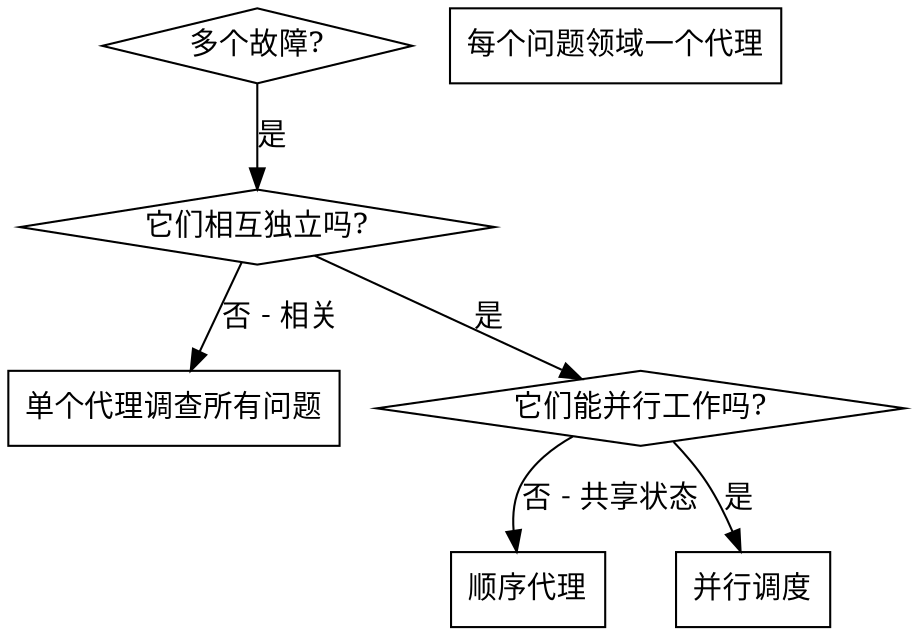

# 调度并行代理 (Dispatching Parallel Agents)

## 概览

当你遇到多个不相关的故障（不同的测试文件、不同的子系统、不同的错误）时，按顺序调查会浪费时间。每个调查都是独立的，可以并行进行。

**核心原则：** 为每个独立的问题领域调度一个代理。让它们并发工作。

## 何时使用

```dot
digraph when_to_use {
    "多个故障?" [shape=diamond];
    "它们相互独立吗?" [shape=diamond];
    "单个代理调查所有问题" [shape=box];
    "每个问题领域一个代理" [shape=box];
    "它们能并行工作吗?" [shape=diamond];
    "顺序代理" [shape=box];
    "并行调度" [shape=box];

    "多个故障?" -> "它们相互独立吗?" [label="是"];
    "它们相互独立吗?" -> "单个代理调查所有问题" [label="否 - 相关"];
    "它们相互独立吗?" -> "它们能并行工作吗?" [label="是"];
    "它们能并行工作吗?" -> "并行调度" [label="是"];
    "它们能并行工作吗?" -> "顺序代理" [label="否 - 共享状态"];
}
```