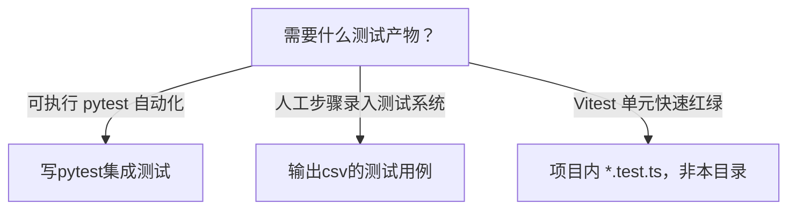

# test-skills 索引

huiyanSkills 下与测试相关的 Agent skill 套件。

## 并列 skill

| Skill | 产物 | 触发场景 |
|-------|------|----------|
| [[输出csv的测试用例/SKILL.md]] | 测试系统可导入 CSV | UI 手工用例、Vitest → 步骤、功能集合 v2 |
| [[写pytest集成测试/SKILL.md]] | pytest + requests `.py` | seccenter 类 HTTP 黑盒 API 集成测试 |

## 如何选择

## Darwin 质量（2026-06-26）

- 父 SKILL 九维评分：**86.9 / 100**（6 轮优化，HL-4 收手）
- 详见 [[写pytest集成测试/evals/results/final-report.md]]

- HTTP 集成：`F:\Documents\Repertory\Sieyuan\nebula\seccenter\tests`
- CSV 模块样本：`输出csv的测试用例/configs/`

## 命名区分

- **联调场景-转CSV步骤**（CSV 套件 roadmap）：多前端模块联调 → **手工 CSV 步骤**，不是 pytest
- **写pytest集成测试**：后端 Gateway HTTP **自动化**
