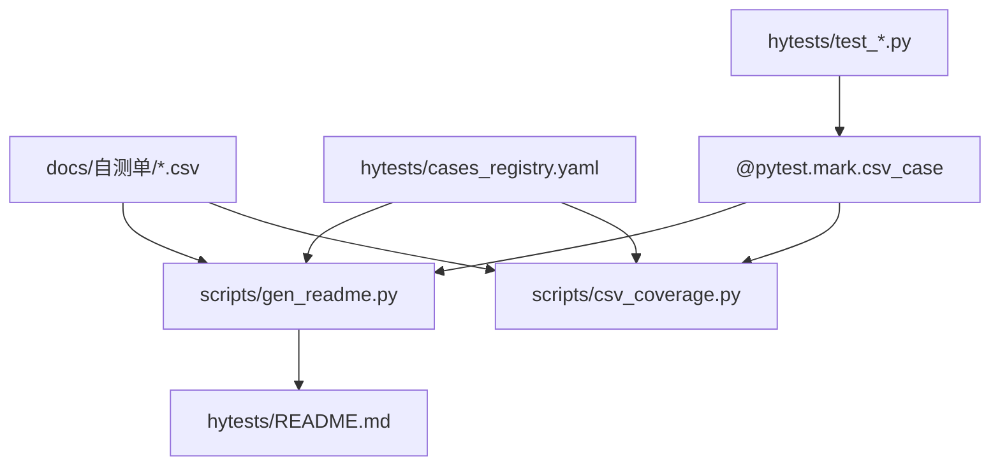

# CSV → hytests 全链路

## 概览



## 目录职责（seccenter 黄金样本）

| 路径 | 职责 |
|------|------|
| `hytests/test_*.py` | CSV ID 对齐的 pytest 实现 |
| `hytests/cases_registry.yaml` | case_id → status / pytest node / refs |
| `hytests/conftest.py` | session、清理 fixture |
| `hytests/config.py` | BASE_URL、CSV_PATH、隔离项目 ID |
| `hytests/pytest.ini` | `csv_case` / `blocked` marker |
| `hytests/scripts/gen_readme.py` | 生成 README.md |
| `hytests/scripts/csv_coverage.py` | 三重覆盖率报告 |
| `hytests/README.md` | 自测手册（Obsidian 阅读） |
| `hytests/README.format-demo.md` | 单条用例格式样例 |
| `tests/test_*.py` | 官方集成测试（registry `refs` 引用） |

## 标准工作流

### 1. 读 CSV 行

从 CSV 读取：`用例ID`、`名称`、`模块名`、`功能集合`、`前置条件`、`测试步骤`、`预留字段1`（预期结果）。

### 2. 写 pytest

- `@pytest.mark.csv_case("{用例ID}")`
- 函数名 `test_csv_{id}_{slug}`
- 断言风格对齐 [[../../写pytest集成测试/references/seccenter-anatomy.md]]，但文件在 `hytests/`

### 3. 写 registry

```yaml
- case_id: "9909"
  name: 导出项目菜单配置为YAML
  module: 菜单管理
  status: implemented
  pytest: test_mvp_menu_9909_9913.py::TestCsvMenuMvp9909_9913::test_csv_9909_export_project_menus_yaml
  refs: tests/test_04_menu.py::TestProjectMenuImportExport
```

### 4. 覆盖率自检

```bash
cd seccenter/hytests
python scripts/csv_coverage.py
```

### 5. 生成 README

```bash
python scripts/gen_readme.py
```

## gen_readme.py 契约（不复制源码，引用黄金实现）

**输入：**

- CSV 路径（config 或脚本内 `CSV_PATH`）
- `cases_registry.yaml`
- 扫描 `test_*.py` 中 `@pytest.mark.csv_case`

**输出：**

- `hytests/README.md`（450+ 条时约 600KB+）
- 每条含：元信息、测试步骤与预期、自动化测试（含实现位置）、手动测试（curl）

**禁止项（生成器不得输出）：**

- `<details>` / `<summary>` 包裹 Markdown
- 测试步骤整块 ` ```text `

**实现位置：**

- `scan_markers()` → 相对路径、marker/def/class 行号
- `resolve_pytest_node()` → registry / refs 行号
- 详见 [[implementation-location-spec.md]]

## 环境

- Gateway：`SECCENTER_TEST_BASE_URL`（非前端 SPA）
- 凭证：`.env.local`（见 `hytests/.env.local.example`）
- 菜单隔离项目：`SECCENTER_TEST_PROJECT_A/B`

## 与官方 tests 的关系

- `hytests`：**CSV 自测单对齐**，手册面向测试人员
- `tests`：**官方回归套件**，可作实现参考（`refs`）
- 详见 [[hytests-vs-official-tests.md]]
