# 实跑评估 · mon-1.9.0 去重词条 EN→RU 全模型并发

> Few-shot 样例目录：`template/few-shot-example/mon-1.9.0-dedup-en2ru-all-models/`  
> 评估对象：SiliconFlow + 讯飞 + 智谱 **`--multi-model --models all`** 生产实跑（非冒烟）。

---

## 1. 结论摘要

| 指标 | 数值 |
|------|------|
| 词条总量 | **3842**（全部填满俄文） |
| 第一遍墙钟 | **10.27 min**（616364 ms） |
| 补跑墙钟 | **1.55 min**（92848 ms，152 空行 resume） |
| 两遍纯计算合计 | **11.82 min** |
| 端到端墙钟（含人工间隔约 40s） | **≈12.48 min**（13:43:13Z → 13:55:42Z） |
| 并发模型路线 | **8** 条（work-share，非同批竞速） |
| DAG 并发上限 | **20** |
| 全模型并发吞吐（第一遍） | **≈374 词条/分钟** |
| 单路线等效吞吐（8 路均摊） | **≈47 词条/分钟·路** |
| 端到端（含补跑）吞吐 | **≈325 词条/分钟**（仅计算） / **≈308 词条/分钟**（含间隔） |

---

## 2. 输入 / 输出（本目录资产）

| 文件 | 说明 |
|------|------|
| [`input.xlsx`](./input.xlsx) | 送翻前去重表（词条+英文翻译多为英文源） |
| [`output_RU.xlsx`](./output_RU.xlsx) | 机翻回填结果（俄文列已满） |
| [`output_RU.csv`](./output_RU.csv) | 同内容 CSV |
| 本评估文档 | `实跑评估-全模型并发-en2ru.md` |

**原始路径（工作区外）：**

- 输入：`...\mon-1.9.0补充qt通用语言\去重文件（去重后，送翻前）_词条导出_20260714075255.xlsx`
- 输出：`...\去重文件（去重后，送翻前）_词条导出_20260714075255_RU机翻.xlsx`

**规模：** 3842 行数据；按 `BATCH_SIZE=40` 切为 **97** 个翻译批次（末批不足 40）。

---

## 3. 命令与策略

```bash
cd translateTool-skills/translate
node translateCsv.js "<input.xlsx>" "<outdir>" \
  --mode en2ru \
  --multi-model --models all \
  --force
# 第一遍后约 152 行空 → 去掉 --force，依赖 skipIfFilled 补跑
node translateCsv.js "<同一输入>" "<outdir>" \
  --mode en2ru \
  --multi-model --models all
```

| 项 | 取值 |
|----|------|
| 模式 | `en2ru`（以词条/英文翻译为源 → 俄文翻译列） |
| 模型策略 | `multi-model` + `models=all`（目录内可用 MT/Chat 全开） |
| 调度 | 批次 round-robin **首选模型**；失败可 failover；同批不重复竞速 |
| DAG | 无依赖批次并行；池上限 `TRANSLATE_DAG_CONCURRENCY` 默认 **20** |

---

## 4. 使用了哪些模型（8 路）

实跑激活的模型 ID（优先分配批次数来自第一遍日志「· 首选 …」）：

| # | 模型 ID | 第一遍首选批次数 | 估计首选词条（×40） |
|---|---------|------------------|---------------------|
| 1 | `xfyun:xophunyuan7bmt` | 13 | ~520 |
| 2 | `siliconflow:tencent/Hunyuan-MT-7B` | 12 | ~480 |
| 3 | `siliconflow:deepseek-ai/DeepSeek-R1-0528-Qwen3-8B` | 12 | ~480 |
| 4 | `siliconflow:Qwen/Qwen3-8B` | 12 | ~480 |
| 5 | `siliconflow:THUDM/GLM-Z1-9B-0414` | 12 | ~480 |
| 6 | `siliconflow:THUDM/GLM-4-9B-0414` | 12 | ~480 |
| 7 | `siliconflow:Qwen/Qwen2.5-7B-Instruct` | 12 | ~480 |
| 8 | `zhipu:glm-4-flash` | 12 | ~480 |
| | **合计** | **97** | **≈3842** |

日志「API批量翻译成功」计数与首选接近（讯飞 14 / Qwen2.5-7B 11 等），说明存在少量 **failover / 重试落地** 到其它提供商，但总量仍为 97 批完成、0 批永久失败。

未纳入本趟 `all` 文本分摊的：视觉/OCR 目录模型（不参与 `--models all` 翻译分摊）。

---

## 5. 并发与时序

### 5.1 并发结构

```
                    ┌─ 上限 20 个 DAG 执行单元同时飞行 ─┐
  97 个 en2ru 批次 ─┤  每批挂「首选模型」之一（8 选 1）   ├─→ 合并写盘/checkpoint
                    └─ 无批间依赖：就绪即跑              ┘
```

- **模型路线数：** 8（分摊负载）
- **HTTP/任务并发上限：** 20（可大于路线数，同一模型可有多批同时 in-flight）
- **第一遍 DAG 波次日志：** 5 次（`当前并发上限=20`）；全程未触发「并发减半」回退
- **补跑：** 4 批首选（讯飞 / Hunyuan-MT / DeepSeek-R1-Qwen3-8B / Qwen3-8B），1 个 DAG 波次

### 5.2 时间线（UTC）

```mermaid
gantt
  title EN→RU 全模型并发实跑时序
  dateFormat HH:mm:ss
  axisFormat %H:%M:%S
  section Pass1
  主跑 3842 词条 / 97 批 / 8 模型 :active, p1, 13:43:13, 616s
  section Gap
  人工间隔 ~40s :crit, g1, 13:53:29, 40s
  section Pass2
  Resume 152 空行 / 4 批 :active, p2, 13:54:09, 93s
```



| 阶段 | started_at (UTC) | ended_at (UTC) | elapsed |
|------|------------------|----------------|---------|
| Pass1 主跑 | 2026-07-14T13:43:13.501Z | 2026-07-14T13:53:29.865Z | **10.27 min** |
| 间隔 | — | — | ≈40 s |
| Pass2 resume | 2026-07-14T13:54:09.710Z | 2026-07-14T13:55:42.558Z | **1.55 min** |

### 5.3 结果质量侧写（Pass1）

| 日志项 | 值 | 解读 |
|--------|-----|------|
| 成功 / 错误（汇总行） | 3618 / 224 | 行级计数；含解析/条数不匹配等 |
| `返回结果数量不匹配` 警告 | 42 | 模型少返回行 → 部分格子未填 |
| 主跑后盘面 | ≈3690 已填 / **152** 空 | 触发 skipIfFilled 补跑 |
| 补跑后 | **3842 / 3842** | 全满 |

---

## 6. 吞吐估算（可复述口径）

记：

- \(N = 3842\) 词条  
- \(T_1 = 10.27\) min（Pass1）  
- \(T_2 = 1.55\) min（Pass2）  
- \(M = 8\) 模型路线  

### 6.1 全模型并发（推荐对外口径）

| 口径 | 公式 | 结果 |
|------|------|------|
| Pass1 毛吞吐 | \(N / T_1\) | **≈374 词条/分钟** |
| Pass1+Pass2 纯计算 | \(N / (T_1+T_2)\) | **≈325 词条/分钟** |
| 含人工间隔墙钟 | \(N / 12.48\) | **≈308 词条/分钟** |

> 「全模型并发 1 分钟能处理多少」→ 取 **≈370–375 词条/分钟**（稳定段 Pass1）；若含补跑与间隔，用 **≈310–325**。

### 6.2 单路线等效（均摊）

在 work-share + 共享墙钟下，单路 **不是** 串行独享全时长，而是 8 路同时贡献：

\[
\frac{N}{M \cdot T_1} \approx \frac{3842}{8 \times 10.27} \approx \mathbf{47}\ \text{词条/分钟·路}
\]

按首选批次数近似：

| 路线 | 首选词条≈ | ÷ Pass1 10.27 min |
|------|-----------|-------------------|
| 讯飞（13 批） | 520 | **≈51 /min** |
| 其余各 Silicon/智谱（12 批） | 480 | **≈47 /min** |

> 「平均一路模型 1 分钟能处理多少」→ 本趟并发条件下的等效份额约为 **47 词条/分钟·路**（非「该模型独占机器时的串行峰值」）。

### 6.3 与批大小关系

- 批大小 40、并发上限 20 → 理论在飞词条约 \(20 \times 40 = 800\) 条量级（受各供应商限流与 RTT 约束，实际利用率低于上限）。
- 条数不匹配/空行会降低一次通过率，补跑使端到端吞吐低于 Pass1 毛吞吐约 **13%**（374→325）。

---

## 7. 可复现检查清单

1. `.env` 配置讯飞 / 硅基 `SILICONFLOW_API_KEY` / 智谱 Key；TLS 按网关要求。  
2. `node scripts/probe-models.js` 确认目录模型可达。  
3. 同上命令跑 `input.xlsx`；对比 `output_RU.xlsx` 俄文列非空率。  
4. 吞吐用本表口径复算，允许 ±15%（网络与供应商波动）。

---

## 8. Few-shot 用法提示

- **规模对照：** 同仓库 `template/few-shot-example/` 顶层的 top5 冒烟；本目录为 **全量去重 3842** 生产形态。  
- **策略对照：** 展示 `en2ru` + `--multi-model --models all` 的真实耗时与并发结构，而非单模型串行。  
- **勿提交：** 含真实 Key 的 `.env`；本目录仅样本表与评估文档。
