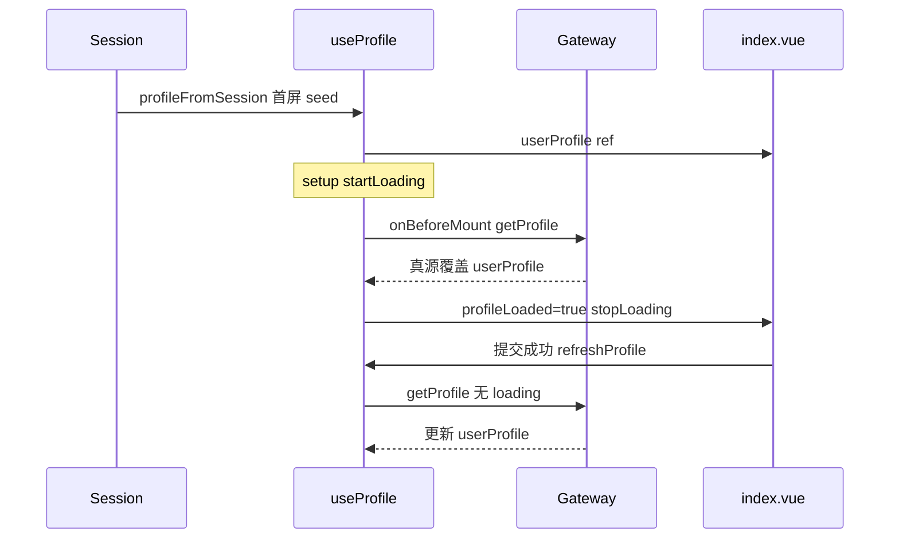

# 领域 hook 数据流

以个人中心 `useProfile`（commit `3a98909`）为参考实现。

## 单数据源原则



| 层 | 职责 |
|----|------|
| session seed | 仅首屏占位，缺 `status` 等字段 |
| 网关 `load` | 唯一真源，覆盖 seed |
| 模板 | 只读 `userProfile`，fallback 用 `"-"` |
| 提交 | 读 `userProfile.value.id`，不重复读 session |

## loaded 与 withLoading 门控

```ts
const withLoading = options?.withLoading ?? !profileLoaded.value;
```

| 调用 | profileLoaded | withLoading | loading |
|------|---------------|-------------|---------|
| 首次 `loadProfile()` | false | true | 有 |
| `refreshProfile()` | true | false | 无 |
| 再次进入页（remount） | false→true | 首次 true | 有 |

## 生命周期（路由页推荐）

1. **setup** 同步 `startLoading()` — 早于 `onMounted`，即时遮罩
2. **onBeforeMount** `void loadProfile()` — 早于 DOM mount 完成
3. **finally** `stopLoading()` — 接口返回后关闭
4. **onUnmounted** `stopLoading()` — 中途切路由兜底

## 边界：microfb 导航

用户「一点击个人中心就 loading」若仍觉晚，可能是 qiankun 子应用 chunk 加载在组件 setup 之前。本子 skill 只覆盖 **子应用内** hook；主应用 `NavbarActions` 点击即 `startLoading` 属 microfb 另案。

## 与 onMounted 分工

| 逻辑 | 归属 |
|------|------|
| 首次/刷新拉 profile | hook `onBeforeMount` |
| `device` 轮询、resize | 页面 `onMounted`（布局） |
| 提交后更新 | `refreshProfile()` |

禁止在 `onMounted` 再 `await refreshProfile()`，会与 hook 首次 load 叠打 detail。
