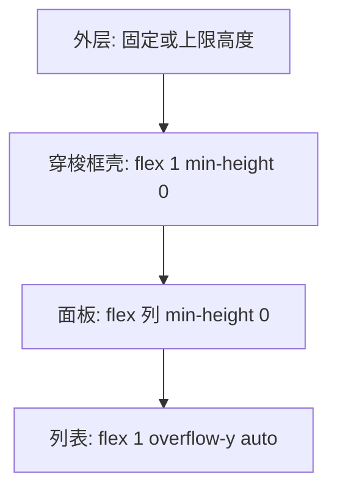

# 页面 UI 必选（接入 Transfer 必过：§①–④ + §⑤）

更新业务页时与 gateway 同等重要。真相源：[`template/after/.../BindDeviceDialog.vue`](../template/after/src/views/tenant/components/BindDeviceDialog.vue)、[`template/after/.../DeviceTab.vue`](../template/after/src/views/system/role/components/DeviceTab.vue)。

## ① 不显示设备数量

**标题**：纯文案，禁止拼接 `(unboundTotal)` / `(boundTotal)`。

```vue
:titles="['待绑定设备', '已绑定设备']"
```

**面板头勾选区**：禁止默认 `3/120`。组件 [`use-check.ts`](../../../apex_dev/src/components/transfer/src/composables/use-check.ts) 在未同时提供 `noChecked` 与 `hasChecked` 时会显示 `${checked}/${total}`。

```vue
:format="transferFormat"
```

```ts
/** use-check 要求 noChecked、hasChecked 均为 truthy；空串 '' 仍会显示 0/N */
const transferFormat = { noChecked: " ", hasChecked: " " };
```

| 位置 | 反模式 | 成品 |
|------|--------|------|
| `titles` | `` `待绑定 (${n})` `` | 纯字符串数组 |
| `format` | 未设置或 `''` | `{ noChecked: " ", hasChecked: " " }`（Dialog + Tab） |

### 横 / 纵滚动术语（改页前必读）

| 方向 | 产品含义 | 实现要点 | 常见误判 |
|------|----------|----------|----------|
| **横向** | 列占满面板宽度 100% | `grid`/`flex` + `minmax(0,1fr)` + `ellipsis` + `:title` 或 tooltip SFC | **不要** `overflow-x: auto`、不要固定列 `min-width` 撑出横滚 |
| **纵向** | 列表在固定高度内可滚完全部行 | `.transfer-container` 高度上限 + `min-height:0` 链 + `.el-transfer-panel__list` / 虚拟列表 `overflow-y: auto` | 用户说「缺滚动条」通常指**纵向**，不是横向 |

## ② CSS 容器链与纵向滚动

目标：列表区域出现**纵向滚动条**，数据可滚全；避免外层无限增高或 flex 子项无法收缩。类名见 [dom-class-map.md](dom-class-map.md)。



| 层级 | Dialog（BindDeviceDialog） | Tab（DeviceTab） |
|------|---------------------------|------------------|
| 外层 | `.transfer-container` `height: 500px` | `.device-transfer-container` `height: min(400px, calc(480px - 48px))` |
| 穿梭框壳 | `.full-height-transfer`：`flex:1; min-height:0; overflow:hidden` | `.device-transfer`：同左 |
| 面板 | `:deep(.el-panel)` flex 列；`.transfer-container :deep(.el-panel) { width:45%; min-width:350px }` | 同左 |
| 列表 | `.el-transfer-panel__list`：`flex:1; min-height:0`；需保证有高度上限 | `overflow-y: auto !important`（after 样本） |

**反模式**

- 父级无固定/上限高度 → 列表撑开页面，**无纵向滚动条**
- 中间层缺 `min-height:0` → flex 子项不收缩，滚动失效
- 列表仅 `overflow: hidden` 且无高度上限 → 内容被裁切、无法滚动
- 仅用 `:deep(.el-transfer-panel)` 写面板 flex/宽度 → 不命中 DOM，布局挤偏（见 [project-device-config-regression.md](../assets/few-shot-example/project-device-config-regression.md)）
- 为「看不全」加 **横向** `overflow-x: auto` → 与产品「省略号 + 纵滚」冲突

**virtual-scroll=true**（Dialog 大数据）时另需行高一致，见 [virtual-scroll.md](virtual-scroll.md)。

## ③ 截断 + tooltip

### MVP：原生 `:title`

每个可截断列在 `#default` 内绑定完整文案：

```vue
<div class="transfer-item__desc" :title="option.device?.deviceName">
  {{ option.device?.deviceName || "-" }}
</div>
```

### 升级 `el-tooltip` 时

- **必须**独立 `.vue` SFC（如 `TransferOverflowText.vue`），`mouseenter` 判断 `scrollWidth > clientWidth`
- **禁止** `defineComponent({ template: '...' })` 字符串模板：Vite 默认无运行时编译，`virtual-scroll` 下 `#default` 会只剩空 checkbox（见 [project-device-config-regression.md](../assets/few-shot-example/project-device-config-regression.md)）

样式（grid/flex 子项必加 `min-width: 0`）：

```scss
.transfer-item__desc {
  overflow: hidden;
  text-overflow: ellipsis;
  white-space: nowrap;
  min-width: 0;
}
```

- 表头 `.header-item` 同样 `ellipsis`；长文案可加 `:title`
- 多列：Tab 用 `grid-template-columns: minmax(0, 1fr) minmax(0, 1fr)`；Dialog 可用 flex 等分

## ④ CSS 优化原则

- `:deep` 限定在 `.transfer-container` / `.device-transfer` 内，避免污染全局
- 表头放在 `#left-footer` / `#right-footer`，与 `#default` 列对齐
- 按钮区宽度：Dialog 样本 `.el-transfer__buttons` `min-width: 100px`；Tab 样本 `flex: 0 0 96px`
- 勿在 skill 改 `template/mvp` 组件源码；页面样式在业务 `.vue` 的 scoped 块维护

## 改页自检（可复制）

- [ ] `titles` 无 `(count)`
- [ ] `:format` 为 `{ noChecked: " ", hasChecked: " " }`（勿用空串）
- [ ] 外层有高度上限；列表 `overflow-y: auto`（或 virtual-scroll 配置正确）
- [ ] 每列 `transfer-item__desc` 有 `:title` + ellipsis（或 SFC tooltip）
- [ ] 面板布局/宽度选择器含 **`.el-panel`**（见 dom-class-map）
- [ ] 未使用 `defineComponent` 字符串 `template` 作 `#default` 子组件
- [ ] 无 `overflow-x: auto` 横滚方案
- [ ] §⑤：filter `order:2`；行间距写在 `.transfer-container`；间距已 DevTools 验收

## ⑤ 间距、flex order 与 DevTools 验收（第二波回归）

> 真相源视觉：**BindDeviceDialog** [`#bindDevice`](../../template/after/src/views/tenant/components/BindDeviceDialog.vue)；结构/order + §⑤ 间距：**ProjectDeviceConfigDialog** [`#projectDeviceConfig`](../../template/after/src/views/tenant/components/ProjectDeviceConfigDialog.vue)（与 apex HEAD 同步）。**EP `transfer.scss` 四边 `padding:15px` 仅作参考**，Dialog 实例常需分段微调。

### flex order（`.el-panel` 平铺子节点）

customTransfer 面板根为 `.el-panel`（flex 列），子节点为兄弟节点。**必须为 filter 显式设 order**，否则默认 `0` 会排在 `header`(1) 之前。

| 节点 | order | 说明 |
|------|-------|------|
| `.el-panel__header` | 1 | 全选 + 标题 |
| `.el-panel__filter` | 2 | 搜索框（**易漏**） |
| `.el-panel__footer` | 3 | `#left-footer` / `#right-footer` 表头 |
| `.el-panel__body` | 4 | 列表区，`flex:1; min-height:0` |

```scss
.full-height-transfer :deep(.el-panel) {
  .el-panel__filter { order: 2; flex-shrink: 0; }
  .el-panel__header { order: 1; flex-shrink: 0; }
  .el-panel__footer { order: 3; flex-shrink: 0; height: auto !important; overflow-y: hidden; }
  .el-panel__body { order: 4; flex: 1; min-height: 0; }
}
```

**反模式**：只给 header/footer/body 设 order → 搜索框浮到标题上方。

### 样式必须命中 `.transfer-container`

Dialog 常 `append-to-body`，列表行类名写死在子组件（`.el-transfer-panel__item`）。EP 的 `.el-transfer-panel .el-transfer-panel__item { padding-left: 22px }` **在 `.el-panel` 根下不生效**。

| 目的 | 写法 |
|------|------|
| 面板宽 45% | `.transfer-container :deep(.el-panel) { width: 45%; min-width: 350px }` |
| header 标题字号 | `.transfer-container :deep(.el-panel__header .el-checkbox__label) { font-size: 16px; font-weight: 550 }` |
| 行 checkbox 与文案间距 | `.transfer-container :deep(.el-transfer-panel__item.el-checkbox)`：`input` `position:absolute; left:15px` + `label { padding-left: 22px }` |
| 表头与 checkbox 对齐 | `.transfer-header { padding-left: 22px }`（与 label 对齐） |

**反模式**：间距只写在 `.full-height-transfer :deep(.el-panel)` 且无 `.transfer-container` 包裹 → 用户侧「CSS 改了没变化」。

### 间距：BindDevice 视觉 > EP 文档（human-verified）

[`ProjectDeviceConfigDialog`](../../template/after/src/views/tenant/components/ProjectDeviceConfigDialog.vue) 实测（勿机械抄 EP 四边 15px）：

```scss
.transfer-container {
  :deep(.el-panel__header) {
    padding-right: 15px;
    padding-bottom: 10px;
    // 勿盲目 padding-left: 15px — 与全选左缘对齐会「双重重叠」
  }
  :deep(.el-panel__filter) {
    box-sizing: border-box !important;
    padding-bottom: 15px !important; /* 仅拉开标题区与搜索区，非 padding: 15px */
  }
}
```

调参顺序：先 fork BindDevice `.transfer-container` → 真机/DevTools 只动 **header↔filter**、**filter↔表头**、**checkbox↔首列** 三处。

### DevTools 验收（改间距后必做）

1. 打开目标 Dialog，F12 选中**列表行** `.el-transfer-panel__item` 或 `.el-panel__filter`。
2. Computed 中应出现**当前 `.vue` 文件**路径下的 scoped 规则（含 `.transfer-container`）。
3. 若规则未出现 → 选择器未命中，**不得**标记 UI 完成。
4. 目视：全选在上、搜索在下、表头在搜索下、列表可纵滚；checkbox 与首列文案间距与 BindDevice 一致。
